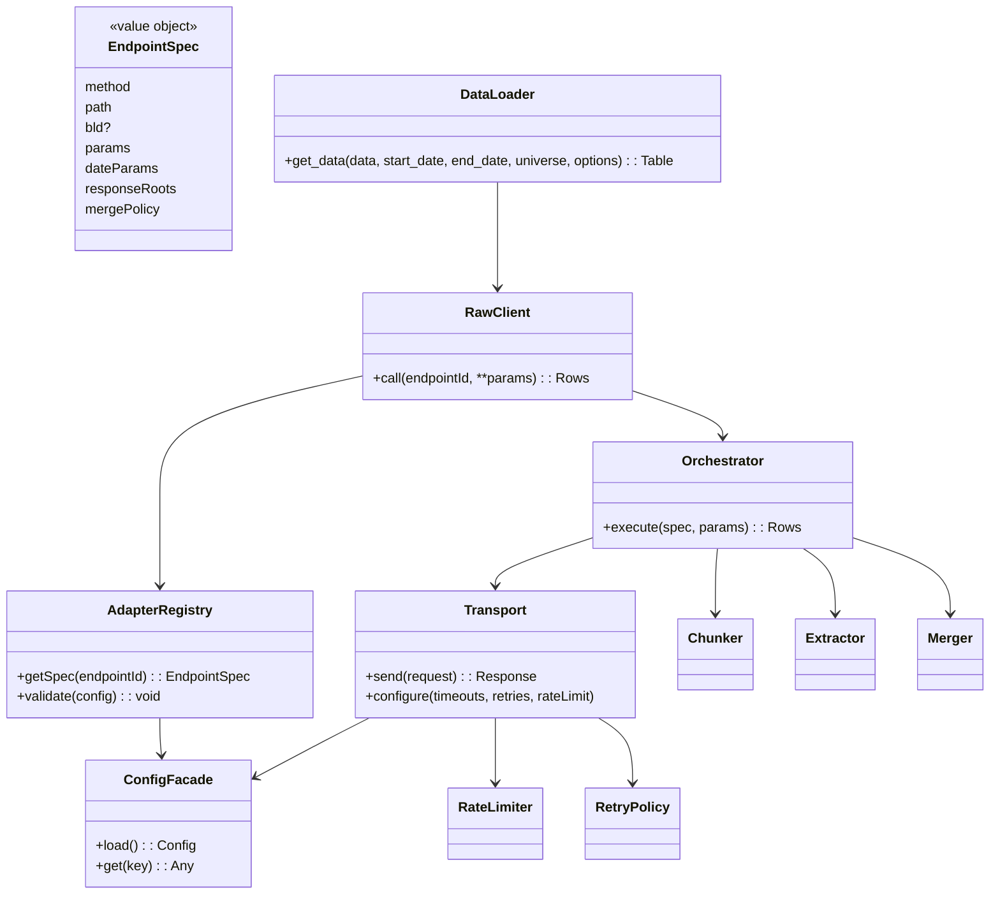
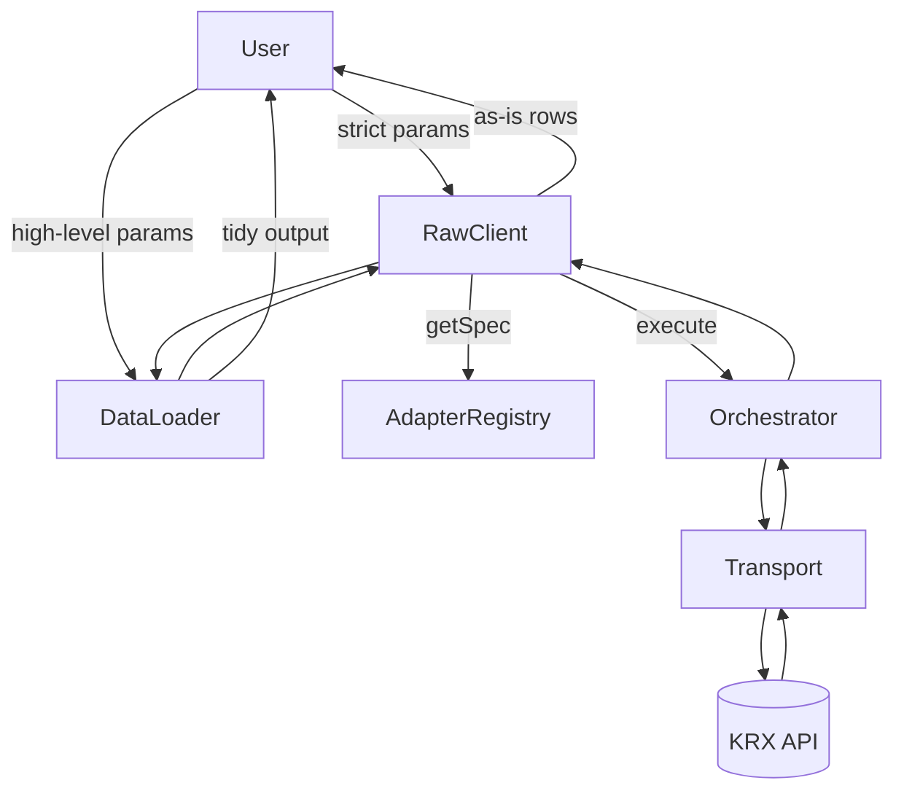
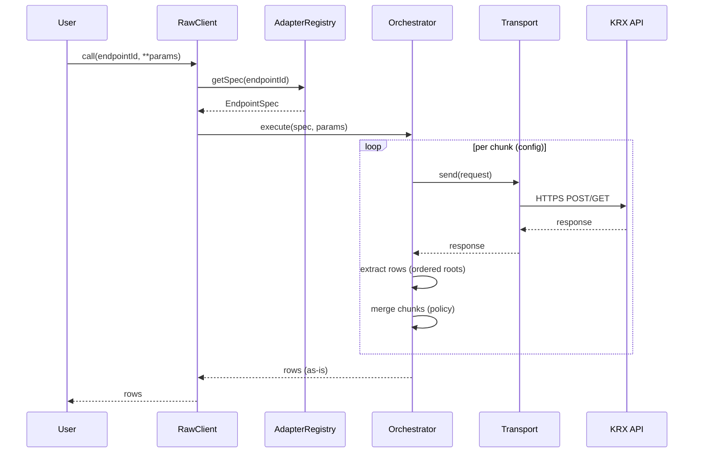
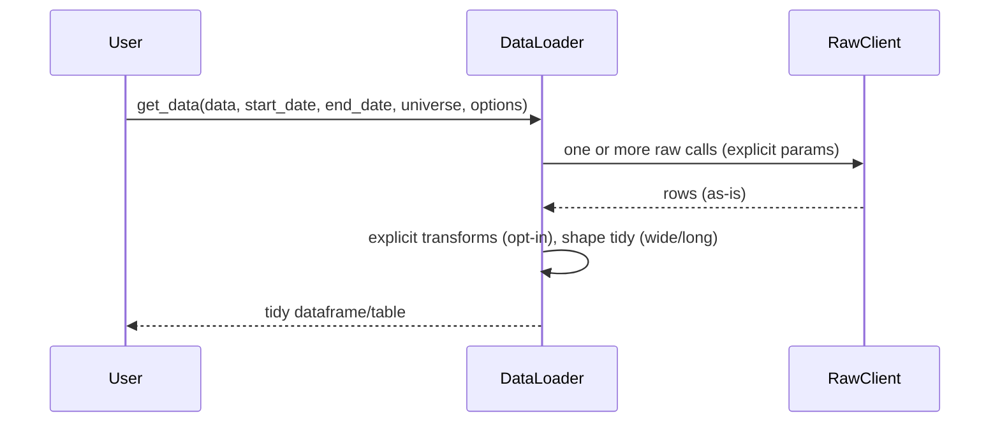
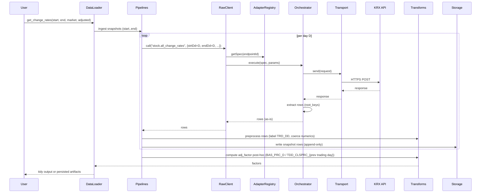
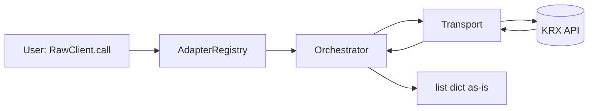
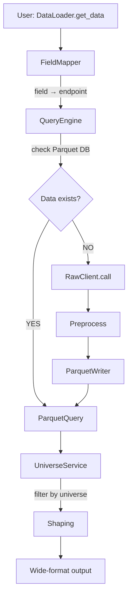
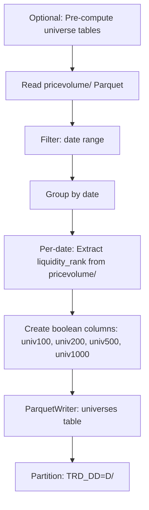
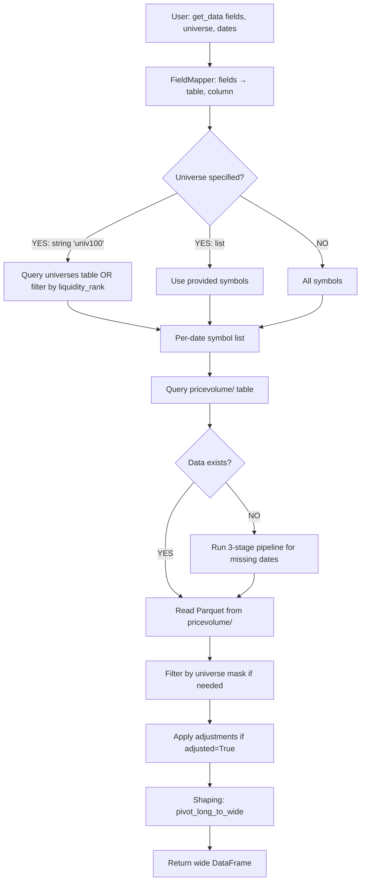

# Architecture: KRX Quant Data Loader (KQDL)

This document specifies the high-level architecture that implements the PRD. It focuses on module boundaries, responsibilities, directory scaffold, and the flow of data. It intentionally avoids code-level details or concrete configuration examples; those belong in implementation.md and config specs.

## Scope and principles

- **As-is data:** Raw layer returns server data without silent transforms or source substitution.
- **Config-driven:** Endpoint specs live in YAML; code is generic and reusable.
- **Two-layer architecture (simplified for MVP):**
  - **Layer 1 (Raw):** Direct 1:1 KRX API wrapper (endpoint-based, `list[dict]` output)
  - **Layer 2 (DataLoader):** Range-locked, stateful API with ephemeral adjustment cache
- **Manual DB build:** Users explicitly run `build_db.py` to populate Parquet DB; no automatic API fallback in queries.
- **Market-wide DB build:** Leverage market-wide endpoints (e.g., `all_change_rates`) to build comprehensive DB; filter client-side for subsets.
- **Hive-partitioned Parquet storage:** Partition by `TRD_DD` (trade date) for fast filtering and incremental ingestion.
- **Batch post-processing:** Adjustment factors and liquidity ranks computed AFTER snapshot ingestion (not during).
- **Range-dependent adjustments:** Cumulative adjustments are query-window-dependent; DataLoader initialized with fixed `[start_date, end_date]`.
- **Ephemeral adjustment cache:** Cumulative multipliers cached in `data/temp/` on DataLoader init; rebuilt per session (cannot be persisted).
- **Transport hygiene & observability:** HTTPS, timeouts, retries, rate limits, structured logs, metrics.

## Architectural patterns

### 1. Two-layer separation with automatic pipeline orchestration
- **Layer 1 (Raw):** Thin, strict wrapper over KRX API. Zero business logic, just endpoint routing and as-is data return.
- **Layer 2 (DataLoader):** Stateful, range-locked loader with automatic 3-stage pipeline on initialization:
  - **Stage 1 - Snapshot ingestion**: Auto-fetch missing data from KRX → preprocess → persist
  - **Stage 2 - Adjustment pipeline**: Compute factors → build ephemeral cumulative adjustment cache
  - **Stage 3 - Universe pipeline**: Compute liquidity ranks → build pre-computed universe tables
  - **On query**: Simple operations (query → filter/mask → pivot)

**Key components:**
- **FieldMapper** (`apis/field_mapper.py`): Config-driven mapping of user-facing field names → (table, column)
  - **Critical role**: Roadmap for data location when user asks for field X
  - Examples: `'close'` → `('snapshots', 'TDD_CLSPRC')`, `'PER'` → `('valuation_metrics', 'PER')`
  - Loaded from `config/fields.yaml`, not hardcoded
- **No intermediate services**: Universe filtering is DataFrame JOIN/masking, not a separate service layer
- **QueryEngine removed**: DataLoader directly queries storage layer via `storage/query.py`
- **UniverseService removed**: Universe filtering is simple DataFrame operations

**Rationale:**
- **Smart initialization**: DataLoader ensures DB completeness on init (fetch → post-process → cache)
- **Dumb queries**: Simple filtering/masking/pivoting operations, no complex orchestration
- **FieldMapper retained**: Essential for extensibility (adding new fields like PER, PBR, etc.)
- **Clear boundaries**: Raw layer (API) | Storage layer (Parquet) | DataLoader (orchestrator + queries)

### 2. Automatic DB build on initialization (changed from manual build)
- **Automatic pipeline:** `DataLoader(db_path, start_date, end_date)` automatically ensures DB completeness for date range
- **3-stage pipeline**: Snapshots → Adjustments+Cache → Liquidity+Universes
- **Resume-safe:** Already-ingested dates are skipped; re-ingestion overwrites partitions (idempotent)
- **Explicit date range:** Users control query window; changing range requires new loader instance

**Rationale (Changed from original "manual build_db.py" design):**
- **Convenience**: Users don't need separate DB build step; just initialize loader
- **Correctness**: Ephemeral cache is always built for correct date range (range-dependent adjustments)
- **Simplicity**: One initialization pattern, not two separate workflows (build vs query)
- **Transparency**: Pipeline stages are explicit; users see what's happening during init

### 3. Market-wide endpoints + client-side filtering
- **Ingestion:** Always fetch ALL stocks for a given date (e.g., `all_change_rates` returns ~3000 stocks/day).
- **Storage:** Store complete market snapshots in Parquet (partitioned by date).
- **Filtering:** Apply universe masks (top_100, custom list) AFTER retrieval from DB.

**Rationale:** 
- Market-wide endpoints are more efficient than per-symbol calls (fewer API requests, bulk data transfer).
- Complete snapshots enable ad-hoc universe definitions without re-fetching.
- Pre-computed liquidity ranks require complete cross-section per date anyway.

### 4. Hive partitioning for fast queries
- **Partition key:** `TRD_DD` (trade date, format YYYYMMDD).
- **Directory structure:** `snapshots/TRD_DD=20230101/data.parquet`, `snapshots/TRD_DD=20230102/data.parquet`, etc.
- **Query optimization:** Date-range filters leverage partition pruning (read only relevant partitions).

**Rationale:** 
- Time-series financial data naturally partitioned by date.
- Most queries are date-range bound (e.g., last 6 months, YTD).
- Partition pruning reduces I/O by orders of magnitude for large DBs.

### 5. Batch post-processing (not streaming)
- **Adjustment factors:** Computed AFTER all snapshots ingested (requires complete table for per-symbol LAG).
- **Liquidity ranks:** Computed AFTER snapshots (requires complete cross-section per date).
- **Decoupled pipelines:** Ingestion → Snapshots → Adj Factors → Liquidity Ranks (each can run independently).

**Rationale:**
- Simplifies ingestion logic (no complex streaming state management).
- Enables idempotent reruns (e.g., recompute ranks for updated snapshots).
- SQL-like semantics (GROUP BY, LAG) naturally expressed in batch operations.

### 6. Storage pipeline: Progressive enrichment with atomic writes (NEW DESIGN)

**Problem with original design:**

Original design had fragmented storage across multiple directories:
```
data/krx_db/
├── snapshots/              # Raw data
├── adj_factors/            # Duplicate data + adj_factor
└── liquidity_ranks/        # Duplicate data + adj_factor + liquidity_rank
```

This created:
- ❌ Data duplication (~3.5 GB for 1.3 GB of actual data)
- ❌ No clear "single source of truth"
- ❌ Confusing semantics: Are these separate tables or views?

**New design: Single persistent DB with progressive column enrichment**

```
data/
├── pricevolume/            # Single source of truth
│   └── market=KOSPI/date=2024-01-01/data.parquet
│       Schema: [raw fields] + adj_factor + liquidity_rank
└── temp/                   # Ephemeral staging
    ├── snapshots/          # Stage 0: Raw API downloads
    ├── staging/            # Stage 1-3: Atomic write staging
    └── backup/             # Stage 2-3: Rollback safety
```

**3-stage sequential pipeline:**

**Stage 0-1: Download → Persist Raw Data**
```
KRX API → temp/snapshots/ → temp/staging/ → ATOMIC MOVE → pricevolume/
Schema: [raw fields only]
```

**Stage 2: Add adj_factor Column (Atomic Rewrite)**
```
Read pricevolume/ → Calculate adj_factor → Write temp/staging/
→ Backup old to temp/backup/ → ATOMIC MOVE → pricevolume/
Schema: [raw fields] + adj_factor
```

**Stage 3: Add liquidity_rank Column (Atomic Rewrite)**
```
Read pricevolume/ → Calculate liquidity_rank → Write temp/staging/
→ Backup old to temp/backup/ → ATOMIC MOVE → pricevolume/
Schema: [raw fields] + adj_factor + liquidity_rank (COMPLETE)
```

**Atomic write guarantees:**

1. **All writes staged first**: Never write directly to persistent DB
2. **Directory-level atomicity**: `shutil.move()` is atomic on same filesystem
3. **Backup before replace**: Rollback capability if move fails
4. **Sequential completion**: Partition added to persistent DB only after ALL stages complete
5. **Crash safety**: Any stage failure → persistent DB unchanged, retry from that stage

**Key benefits:**

- ✅ **62% space savings**: 1.3 GB instead of 3.5 GB
- ✅ **Single source of truth**: `data/pricevolume/` for all queries
- ✅ **Progressive enrichment**: Columns added incrementally, no duplication
- ✅ **Crash-safe**: Atomic operations at every stage
- ✅ **No incomplete data**: Sequential completion guarantee
- ✅ **Clean temp separation**: `temp/` auto-cleanup after success

### 7. Range-dependent adjustments with ephemeral cache (CRITICAL DESIGN)

**Problem discovered during Samsung 2018 split experiment:**

Adjustment factors are "event markers" (e.g., `0.02` for 50:1 split), but applying them requires **cumulative multiplication**. Critically, cumulative adjustments **depend on the query window**.

**Concrete example (Samsung Electronics 50:1 split on 2018-05-04):**

```
Scenario A: Query [2018-01-01, 2018-03-31] (Q1 only, BEFORE split)
→ No future splits visible in window
→ Adjusted close on 2018-01-01: ₩2,520,000 (no adjustment needed)
→ Adjusted close on 2018-03-31: ₩2,650,000 (no adjustment needed)

Scenario B: Query [2018-01-01, 2018-12-31] (Full year, INCLUDES split)
→ May split is visible in window
→ Adjusted close on 2018-01-01: ₩50,400 (2,520,000 × 0.02)
→ Adjusted close on 2018-03-31: ₩53,000 (2,650,000 × 0.02)
```

**Key insight**: The **same historical date** has **different adjusted prices** depending on what future corporate actions are visible in the query window. This is mathematically correct: adjusted prices normalize all history to the most recent scale visible in the window.

**Architectural solution:**

1. **Range-locked DataLoader**:
   ```python
   loader = DataLoader(db_path, start_date='20180101', end_date='20181231')
   # Cumulative adjustments fixed to this [start, end] window
   ```

2. **Persistent storage (event markers)**:
   ```
   data/krx_db/adj_factors/
   └── TRD_DD=20180504/data.parquet  # factor = 0.02 (event)
   ```

3. **Ephemeral cache (cumulative multipliers)**:
   ```
   data/temp/cumulative_adjustments/
   └── TRD_DD=20180101/data.parquet  # cum_adj = 0.02 (product of future)
   ```

4. **Cache computation algorithm**:
   ```python
   # On DataLoader.__init__(start_date, end_date):
   
   # Step 1: Query event markers for THIS window
   factors = query_parquet_table(
       table='adj_factors',
       start_date=start_date,
       end_date=end_date
   )
   
   # Step 2: Per-symbol, compute cumulative product (REVERSE chronological)
   for symbol in symbols:
       factors_sorted = sort(factors[symbol], by='TRD_DD')
       cum_adj = []
       cum = 1.0
       for factor in reversed(factors_sorted):  # Future → Past
           cum *= factor
           cum_adj.insert(0, cum)
       # Result: [0.02, 0.02, ..., 0.02, 1.0, 1.0, 1.0]
       #         ↑ before split      ↑ after split
   
   # Step 3: Write to temp cache (Hive-partitioned by TRD_DD)
   write_to_temp('data/temp/cumulative_adjustments/', cum_adj_rows)
   ```

5. **Query-time application**:
   ```python
   # In DataLoader.get_data(field='close', adjusted=True):
   
   raw_prices = query_parquet_table(table='snapshots', ...)
   cum_adj = query_parquet_table(table='cumulative_adjustments', ...)  # From temp!
   
   adjusted_prices = raw_prices * cum_adj
   return pivot_to_wide(adjusted_prices)
   ```

**Why cumulative adjustments CANNOT be persistent:**

```python
# Day 1: Build cache for [2018-01-01, 2018-05-31]
cache['2018-01-01']['cum_adj'] = 0.02  # Split on 2018-05-04 visible

# Day 2: User adds 2018-12-31 data (another split occurs!)
# → ALL historical multipliers change
# → Cannot incrementally update cache
# → Must rebuild from scratch for new window
```

**Rationale for temp cache (not in-memory only):**
- **Performance**: Rebuilding cache takes ~1-2 seconds; queries are instant (just read + multiply)
- **Disk-based**: Handles large datasets (years of data × thousands of stocks)
- **Hive-partitioned**: Query optimization (partition pruning) works on temp cache
- **Session-scoped**: Automatically stale on new session (regenerated with correct window)

**Rationale for range-locked pattern:**
- **Correctness**: Users explicitly choose query window; adjusted prices reflect that choice
- **Transparency**: Changing window requires new loader (explicit, not hidden)
- **Simplicity**: One cache build per session; no complex invalidation logic
- **Performance**: Sub-range queries within window are instant (no cache rebuild)

## Package scaffold (actual implementation)

```text
krx_quant_dataloader/
  __init__.py                # Package initialization
  factory.py                 # Factory functions for building Layer 1 stack (RawClient creation)
  
  # Layer 1: Raw KRX API Wrapper
  config.py                  # Pydantic settings (ConfigFacade, HostConfig, TransportConfig, RateLimitConfig)
  transport.py               # HTTPS session, retries, timeouts, auto-configured rate limiting
  rate_limiter.py            # Token bucket rate limiter (per-host, thread-safe)
  adapter.py                 # Endpoint registry (AdapterRegistry), validation, spec normalization
  orchestration.py           # Request builder, chunker, extractor, merger (Orchestrator)
  client.py                  # Raw interface (as‑is), param validation/defaults (RawClient)
  
  # Layer 2: High-Level DataLoader API
  apis/
    dataloader.py            # Range-locked, stateful loader with automatic pipeline initialization
    field_mapper.py          # Config-driven field name → (table, column) mapping
  
  # Core Transforms
  transforms/
    preprocessing.py         # TRD_DD labeling, numeric coercion (comma strings → int)
    shaping.py               # Wide/long pivot operations (pivot_long_to_wide)
    adjustment.py            # Per-symbol LAG-style factor computation + cumulative multiplier builder
    validation.py            # Optional schema validation
  
  # Pipelines (3-Stage Progressive Enrichment)
  pipelines/
    orchestrator.py          # Coordinates 3-stage pipeline (download → adj_factor → liquidity_rank)
    snapshots.py             # Resume-safe per-day ingestion (legacy, deprecated in favor of orchestrator)
    liquidity_ranking.py     # Liquidity rank computation
    universe_builder.py      # Universe table construction
  
  # Storage Layer (Progressive Enrichment with Atomic Writes)
  storage/
    protocols.py             # SnapshotWriter protocol (ABC, legacy)
    writers.py               # TempSnapshotWriter, PriceVolumeWriter, ParquetSnapshotWriter (legacy)
    enrichers.py             # AdjustmentEnricher, LiquidityRankEnricher (progressive column addition)
    query.py                 # Parquet query helpers (generic table queries, universe loading)
    schema.py                # PyArrow schemas (PRICEVOLUME_SCHEMA, UNIVERSES_SCHEMA, CUMULATIVE_ADJUSTMENTS_SCHEMA)
  
  # Domain (Lightweight Models & Errors)
  domain/
    models.py                # Data models
    errors.py                # Typed exceptions
  
# Config Files (YAML)
config/
  settings.yaml              # Main configuration (paths, version)
  endpoints.yaml             # Endpoint specs (hosts, endpoints)
  fields.yaml                # Field name → (table, column) mappings

# Data directories (actual storage structure)
data/
  pricevolume/               # Single persistent DB (single source of truth)
    TRD_DD=20240101/         # Single-level partitioning by date
      data.parquet           # ALL markets + adj_factor + liquidity_rank
    TRD_DD=20240102/
      data.parquet
  
  temp/                      # Ephemeral staging and cache (NOT version controlled)
    snapshots/               # Stage 0: Raw API downloads (temporary)
      TRD_DD=20240101/raw.parquet
    staging/                 # Stage 1-3: Atomic write staging
      TRD_DD=20240101/data.parquet
    backup/                  # Stage 2-3: Rollback safety
      TRD_DD=20240101/data.parquet
    cumulative_adjustments/  # Cumulative multipliers (rebuilt per DataLoader init)
      TRD_DD=20240101/data.parquet
  
  universes/                 # Pre-computed universe tables (optional, persistent)
    TRD_DD=20240101/data.parquet
```

**Actual implementation (2025-01):**

1. **Single persistent DB with single-level partitioning**: `data/pricevolume/TRD_DD=YYYYMMDD/`
   - **CRITICAL DECISION**: Changed from two-level `market/date` to single-level `TRD_DD` partitioning
   - **Rationale**: API fetches all markets together (`mktId=ALL`), store together for efficiency
   - Progressive column enrichment: raw fields (11 cols) → +adj_factor (12 cols) → +liquidity_rank (13 cols)
   - Eliminates data duplication (~62% space savings: 1.3 GB vs 3.5 GB)
   - Single source of truth for all queries

2. **Atomic write pattern with staging/backup**:
   - All writes staged to `temp/staging/TRD_DD={date}/` before atomic move
   - Backup to `temp/backup/TRD_DD={date}/` for rollback safety (Stage 2-3 only)
   - `shutil.move()` provides directory-level atomicity on same filesystem
   - Crash-safe at every stage: persistent DB unchanged if stage fails

3. **Temporary snapshots cleanup**: 
   - Raw API downloads → `temp/snapshots/TRD_DD={date}/raw.parquet`
   - Automatically deleted after successful Stage 1 completion
   - Never persisted to version control

4. **Storage layer modules**:
   - **`storage/schema.py`**: PyArrow schemas with `PRICEVOLUME_RAW_SCHEMA` (Stage 1) and `PRICEVOLUME_SCHEMA` (Stage 2-3)
   - **`storage/writers.py`**: `TempSnapshotWriter`, `PriceVolumeWriter` (atomic), `ParquetSnapshotWriter` (legacy)
   - **`storage/enrichers.py`**: `AdjustmentEnricher`, `LiquidityRankEnricher` for progressive column addition
   - **`storage/query.py`**: Generic `query_parquet_table()` with partition/row-group/column pruning

5. **Configuration hierarchy**:
   - **`config/settings.yaml`**: Main config (paths, version) - loads first
   - **`config/endpoints.yaml`**: Endpoint specs (hosts, endpoints) - referenced by settings.yaml
   - **`config/fields.yaml`**: Field mappings (`close` → `(pricevolume, TDD_CLSPRC)`)
   - ConfigFacade loads settings.yaml → endpoints.yaml in cascade

6. **Ephemeral cumulative adjustments cache**:
   - Location: `data/temp/cumulative_adjustments/TRD_DD={date}/`
   - Rebuilt on each DataLoader initialization for specified date range
   - Range-dependent: Same historical date has different adjusted prices depending on query window
   - **Must be in `.gitignore`**: Session-specific, not persistent

7. **DataLoader automatic pipeline**:
   - Initialization triggers 3-stage pipeline via `PipelineOrchestrator`
   - Stage 0-1: Download → Stage raw to pricevolume DB (raw fields only)
   - Stage 2: Enrich with adj_factor (atomic rewrite of each partition)
   - Stage 3: Enrich with liquidity_rank (atomic rewrite of each partition)
   - Stage 4: Build cumulative adjustments cache + universe tables (optional)
   - Sequential completion: All stages complete for each date before moving to next

8. **Key simplifications**:
   - No QueryEngine: DataLoader queries storage layer directly via `query.py`
   - No UniverseService: Universe filtering is simple DataFrame operations
   - FieldMapper retained: Essential for extensibility (adding new fields like PER, PBR)
   - Factory pattern: `factory.py` provides `create_raw_client()` for DI

**Implementation status**: ✅ Production-ready
- 122/122 tests passing (excluding deprecated backward-compatibility tests)
- Live smoke test validated with Samsung 50:1 split detection
- 62% space savings confirmed
- Atomic writes verified
- No obsolete directory creation

## Component responsibilities

### Layer 1: Raw KRX API Wrapper (unchanged)

- **Transport** (`transport.py`)
  - HTTPS-only session with timeouts, bounded retries/backoff, **config-driven per-host rate limiting**.
  - **Token bucket rate limiter** (`rate_limiter.py`): Thread-safe, per-host request throttling; blocks when rate limit exceeded.
  - Rate limit auto-configured from `config.hosts[host_id].transport.rate_limit.requests_per_second`.
  - Emits structured logs and metrics for requests (pending observability milestone).
  
- **Adapter** (config registry)
  - Loads and validates endpoint YAML.
  - Exposes immutable endpoint specs (method, path, `bld`, params with roles, client policy, response root keys).
  
- **Orchestration** (`orchestration/`)
  - Builds requests from spec+params, executes chunking loops, extracts rows via ordered root keys, merges chunks per policy.
  - No transforms beyond merge/ordering; never substitutes sources.
  
- **RawClient** (`client.py`)
  - Public, strict surface requiring full endpoint parameters.
  - Returns as-is results (`list[dict]`), with typed errors.

### Layer 2: High-Level DataLoader API (REFACTORED)

- **DataLoader** (`apis/dataloader.py`) - **SIMPLIFIED (~370 lines, down from 631)**
  - **Range-locked initialization**: `DataLoader(db_path, start_date, end_date)` delegates 3-stage pipeline to `PipelineOrchestrator`
  - **Query execution (simple filtering + pivoting)**: `get_data(field, universe, query_start, query_end, adjusted)`
    1. Resolve field name via FieldMapper: `'close'` → `('snapshots', 'TDD_CLSPRC')`
    2. Query field data from appropriate table (via `storage/query.py`)
    3. If `universe` specified: 
       - If string (e.g., `'univ100'`): Query universe table with boolean filter → get per-date symbol lists
       - If list (e.g., `['005930', '000660']`): Use as fixed symbol list for all dates
       - JOIN/mask queried data on (TRD_DD, ISU_SRT_CD)
    4. If `adjusted=True`: Query cumulative multipliers from temp cache → multiply prices
    5. Pivot to wide format: index=dates, columns=symbols
  
  - **Key design**: Delegates orchestration to `PipelineOrchestrator`, focuses on query interface

- **PipelineOrchestrator** (`pipelines/orchestrator.py`) - **NEW (~370 lines)**
  - **Coordinates 3-stage pipeline** for DataLoader initialization:
    - **Stage 1 - Snapshot ingestion**:
      1. Check if snapshots exist for [start_date, end_date]
      2. If missing → fetch from KRX via raw client → preprocess → persist to `data/krx_db/snapshots/`
    - **Stage 2 - Adjustment pipeline**:
      1. Compute adjustment factors from snapshots → persist to `data/krx_db/adj_factors/`
      2. Compute cumulative multipliers for date range (reverse chronological product)
      3. Write to ephemeral cache `data/temp/cumulative_adjustments/`
    - **Stage 3 - Universe pipeline**:
      1. Compute liquidity ranks from snapshots → persist to `data/krx_db/liquidity_ranks/`
      2. Build pre-computed universe tables from ranks → persist to `data/krx_db/universes/`
  
  - **Key design**: Delegates to specialized pipeline modules (snapshots.py, liquidity_ranking.py, universe_builder.py)
  - **Single Responsibility**: Pipeline orchestration only (no query logic)

- **FieldMapper** (`apis/field_mapper.py`)
  - Maps user-facing field names → (table, column) via `config/fields.yaml`
  - Examples: `'close'` → `('snapshots', 'TDD_CLSPRC')`, `'liquidity_rank'` → `('liquidity_ranks', 'xs_liquidity_rank')`
  - Lightweight config tool, not business logic service

- **Factory** (`factory.py`) - **NEW (~60 lines)**
  - `create_raw_client(config_path)`: Builds Layer 1 stack (Config → Transport → Orchestrator → RawClient)
  - Centralizes composition root for testability and reuse
  - Used by DataLoader for lazy RawClient initialization

### Core Transforms & Pipelines

- **Transforms** (`transforms/`)
  - **Preprocessing** (`preprocessing.py`): Client‑side labeling (e.g., `TRD_DD`), numeric coercions (comma-separated strings → int).
  - **Shaping** (`shaping.py`): Wide/long pivots for tidy outputs (`pivot_long_to_wide`); no data cleaning.
  - **Adjustment** (`adjustment.py`): Post‑hoc per‑symbol, date‑ordered factors (SQL LAG semantics); pure computation, no I/O.
  - **Validation** (`validation.py`): Optional schema validation.

- **Pipelines** (`pipelines/`)
  - **Snapshots** (`snapshots.py`):
    - Resume‑safe ingestion: `ingest_change_rates_day()` fetches one day, preprocesses, persists via `ParquetWriter`.
    - `ingest_change_rates_range()` iterates dates with per-day isolation (errors on one day do not halt subsequent days).
    - Post-hoc adjustment: `compute_and_persist_adj_factors()` runs AFTER ingestion; computes per-symbol factors.
  - **Universe Builder** (`universe_builder.py`) *(NEW)*:
    - Batch post-processing: Reads snapshots Parquet, ranks by `ACC_TRDVAL` per date.
    - Outputs: `liquidity_ranks` table with `(TRD_DD, ISU_SRT_CD, xs_liquidity_rank, ACC_TRDVAL)`.
    - Idempotent: Can re-run for new date ranges.
  - **Loaders** (`loaders.py`): Optional batch loaders for other endpoints.

### Storage Layer (Parquet-based)

- **Protocols** (`storage/protocols.py`)
  - `SnapshotWriter` protocol for dependency injection; decouples pipelines from storage backend.

- **Writers** (`storage/writers.py`)
  - **`TempSnapshotWriter`**: Writes raw API downloads to `temp/snapshots/` (Stage 0, temporary).
  - **`PriceVolumeWriter`**: Atomic write pattern for persistent DB (Stage 1-3).
    - Writes to `temp/staging/` first, then atomically moves to `pricevolume/`
    - Supports progressive column enrichment (raw → +adj_factor → +liquidity_rank)
    - Hive-partitioned by `market` and `date` (e.g., `pricevolume/market=KOSPI/date=2024-01-01/`)
    - Idempotent: Can safely rewrite partitions via backup → move → cleanup pattern
  - **`CSVSnapshotWriter`**: Legacy/debugging; UTF-8, no BOM, append-only.

- **Query** (`storage/query.py`)
  - Generic Parquet query helpers using **PyArrow** (partition/row-group/column pruning).
  - **`query_parquet_table(db_path, table_name, start_date, end_date, symbols, fields)`**:
    - Data-type-neutral function for querying any Hive-partitioned table
    - Works for `snapshots`, `adj_factors`, `liquidity_ranks`, and future tables
    - Returns Pandas DataFrame (user-friendly, default)
    - Optimizations: partition pruning (date range), row-group pruning (symbols), column pruning (fields)
  - **`load_universe_symbols(db_path, universe_name, start_date, end_date)`**:
    - Loads pre-computed universe symbol lists from `liquidity_ranks` table
    - Returns `{date: [symbols]}` mapping for per-date filtering
    - Supports: `'univ100'`, `'univ200'`, `'univ500'`, `'univ1000'`, `'univ2000'`
  - **DuckDB consideration**: Not in MVP; may add for SQL interface if needed later.

- **Schema** (`storage/schema.py`)
  - Parquet schema definitions:
    - **pricevolume** (single unified table): `ISU_SRT_CD, ISU_ABBRV, MKT_NM, BAS_PRC, TDD_CLSPRC, CMPPREVDD_PRC, ACC_TRDVOL, ACC_TRDVAL, FLUC_RT, FLUC_TP, MKT_ID, adj_factor, liquidity_rank`
      - **Raw fields** (from KRX API): `ISU_SRT_CD, ISU_ABBRV, MKT_NM, BAS_PRC, TDD_CLSPRC, CMPPREVDD_PRC, ACC_TRDVOL, ACC_TRDVAL, FLUC_RT, FLUC_TP, MKT_ID`
      - **Enriched fields** (added in pipeline): `adj_factor` (Stage 2), `liquidity_rank` (Stage 3)
      - **REMOVED**: `OPNPRC`, `HGPRC`, `LWPRC` (don't exist in `stock.all_change_rates` endpoint)
      - **Partition keys**: `market` and `date` (in directory structure, not in data files)
      - **Progressive enrichment**: Schema complete from Stage 1, columns filled in Stage 2-3
    - **universes** (optional pre-computed): `ISU_SRT_CD, univ100, univ200, univ500, univ1000, xs_liquidity_rank` (boolean column schema)
      - **DESIGN CRITICAL**: Boolean columns (int8: 0 or 1) instead of string `universe_name` column
      - **Rationale**: 10-100x faster filtering via boolean masks vs string comparisons
      - One row per stock per date with boolean flags for all universe tiers
      - Subset relationships explicit: univ100=1 implies univ200=1, univ500=1, univ1000=1
      - Query efficiency: `df[df['univ100'] == 1]` vs `df[df['universe_name'] == 'univ100']`
      - Better compression: int8 flags compress better than string values
    - **cumulative_adjustments** (ephemeral): `ISU_SRT_CD, cum_adj_multiplier` (float64)
      - Computed from adj_factors on DataLoader init
      - Stored in `data/temp/cumulative_adjustments/` (not persisted long-term)
      - Hive-partitioned by `TRD_DD` for query optimization

### Hive Partitioning Strategy

**Partitioning decision: Single-level by `TRD_DD` only**

```
data/
├── pricevolume/                    # Single persistent DB (single source of truth)
│   ├── TRD_DD=20240101/
│   │   └── data.parquet            # Complete: ALL markets + adj_factor + liquidity_rank
│   ├── TRD_DD=20240102/
│   │   └── data.parquet
│   └── ...
├── temp/
│   ├── snapshots/                  # Stage 0: Raw API downloads (temporary)
│   │   └── TRD_DD=20240101/raw.parquet
│   ├── staging/                    # Stage 1-3: Atomic write staging
│   │   └── TRD_DD=20240101/data.parquet
│   ├── backup/                     # Stage 2-3: Rollback safety
│   │   └── TRD_DD=20240101/data.parquet
│   └── cumulative_adjustments/     # Ephemeral cache (range-dependent)
│       └── TRD_DD=20240101/data.parquet
└── universes/                      # Optional pre-computed (boolean columns)
    ├── TRD_DD=20240101/
    │   └── data.parquet            # Boolean: univ100, univ200, univ500, univ1000
    └── ...
```

**Rationale:**
- **Query pattern:** Date-range filtering is primary; market filtering is secondary (done in-memory via MKT_ID column)
- **Partition pruning:** Single-level partitioning by date enables fast range queries
- **Workflow alignment:** API calls fetch ALL markets (`mktId=ALL`) in single response, store together naturally
- **Single persistent table:** No data duplication; `pricevolume/` contains everything
- **Progressive enrichment:** Same partition progressively enriched (raw → +adj_factor → +liquidity_rank)
- **Optimal file size:** One file per date containing all markets (~200-300 MB, perfect for SSD)
- **Write efficiency:** Atomic rewrites use `temp/staging/` → `temp/backup/` → move pattern
- **Simplicity:** Fewer directories, simpler code, easier debugging

**Why NOT partition by market or symbol:**
- ❌ **Per-market partitioning (`market/date`):** Doesn't match API workflow (fetch all markets together), requires splitting response, more complex
- ❌ **Per-symbol partitioning (`date/ISU_SRT_CD`):** Too many small files (3000/day), poor I/O efficiency, metadata overhead
- ❌ **Per-universe partitioning (`universe/date`):** Data duplication (univ500 includes univ100), static universes (membership changes daily)

**Market filtering in practice:**
```python
# Read date range (partition pruning on date)
df = pd.read_parquet("data/pricevolume/", 
                     filters=[('date', '>=', '2024-01-01'), ('date', '<=', '2024-01-31')])

# Filter by market in memory (fast, 200 MB files)
kospi_df = df[df['MKT_ID'] == 'STK']  # KOSPI only
```

**Performance optimizations:**

1. **Sorted writes:** Sort data by `ISU_SRT_CD` before writing Parquet; enables row-group pruning.
   ```python
   rows_sorted = sorted(rows, key=lambda r: r['ISU_SRT_CD'])
   # Row group 1: ISU_SRT_CD ['000001' - '010000']
   # Row group 2: ISU_SRT_CD ['010001' - '020000']
   # Query for '005930' → only reads row group 1
   ```

2. **Row group size:** 1000 rows per row group (~1000 stocks); balances row-group pruning granularity vs. overhead.

3. **Compression:** Zstd level 3 (better compression than Snappy, fast decompression).

4. **Column ordering:** Primary filter keys (`ISU_SRT_CD`) early in schema for better row-group statistics.

**Expected query performance (SSD):**
- 100 stocks × 252 days: ~100-500 ms
- 500 stocks × 252 days: ~200-800 ms
- Full market (3000 stocks × 252 days): ~1-3 seconds

**Query execution plan:**
```python
# Step 1: Partition pruning (metadata only, fast)
partitions = [TRD_DD=20230101, ..., TRD_DD=20231231]  # Only 252 partitions scanned

# Step 2: Resolve universe (parallel query on liquidity_ranks)
universe_symbols = {'20230101': ['005930', ...], '20230102': [...], ...}

# Step 3: Read snapshots with optimizations
df = read_parquet(
    partitions=partitions,                      # Partition pruning
    columns=['TRD_DD', 'ISU_SRT_CD', 'TDD_CLSPRC'],  # Column pruning
    filters=[('ISU_SRT_CD', 'in', symbols)]     # Row-group pruning
)

# Step 4: Apply per-date universe mask (in-memory)
df = filter_by_universe(df, universe_symbols)
```

### Supporting Modules

- **Domain** (`domain/`)
  - Lightweight models and typed errors (ConfigError, RegistryValidationError, ParamValidationError). No IO.

- **Observability**
  - Pluggable logging/metrics with consistent context (endpoint id, retries, latency).

- **Config Facade** (`config/`)
  - Centralized configuration (Pydantic settings) for endpoints, field mappings, transport policy.
  - Single YAML load; modules accept config object rather than reading files/env directly.

## Why an Orchestrator

- Problem shape:
  - KRX endpoints vary in date parameter names, maximum fetch spans, and response root keys. To preserve “as‑is” semantics you must: build payloads from specs, loop date chunks per policy, call transport, extract rows using ordered root keys, then merge chunks without transforming values.

- With an orchestrator:
  - Single place to implement chunking/extraction/merge policy; avoids duplication and drift across endpoints.
  - Clear separation: adapter (specs only), transport (IO only), raw client (thin facade), apis (tidy outputs). Each layer has one responsibility.
  - Enforces the “as‑is” contract on the raw path (no transforms/fallbacks), with uniform logging/metrics.
  - Testability: unit-test loops/merges/extraction once with mocks; robust and cheaper to maintain.

- Without an orchestrator:
  - The loop and extraction logic leaks into RawClient and/or individual call sites, increasing duplication and inconsistency.
  - Transport or adapter risk absorbing non‑concerns (e.g., chunking in transport, execution logic in adapter), blurring boundaries.
  - Higher test surface area and greater risk of inadvertently introducing transforms in the raw path.

- Conclusion:
  - Centralizing the mechanical workflow (chunk → request → extract → merge) in an orchestrator reduces complexity elsewhere, keeps the raw client thin, and preserves the PRD’s “as‑is” guarantees. For very small scopes, you could inline this logic, but as endpoints grow, the orchestrator pays for itself quickly.

## UML: high-level classes/components



## User flow (two public interfaces)



## Sequence: raw call (as-is)



## Sequence: apis call (tidy)



## Sequence: MDCSTAT01602 daily snapshot with adj_factor



## Data flow: Three-layer architecture

### Layer 1: Raw API (endpoint-based, as-is)


### Layer 2: DB Services (field-based, DB-first)


### Layer 3: High-Level DataLoader (wide-format, universe-filtered)


## Pipeline data flows

### Pipeline 1: 3-stage progressive enrichment (IMPLEMENTED)

```mermaid
flowchart TD
    A[User: DataLoader init] --> B[PipelineOrchestrator.ensure_data_ready]
    B --> C[Stage 0-1: Download & Persist Raw]
    C --> D[RawClient.call: all_change_rates]
    D --> E[Write to temp/snapshots/TRD_DD=D/]
    E --> F[Preprocess: TRD_DD label, numeric coercion]
    F --> G[Write to temp/staging/TRD_DD=D/]
    G --> H[ATOMIC MOVE to pricevolume/TRD_DD=D/]
    H --> I[Delete temp/snapshots/TRD_DD=D/]
    I --> J[Stage 2: Enrich adj_factor]
    J --> K[Read pricevolume/TRD_DD=D/ partition]
    K --> L[Calculate adj_factor per-symbol LAG]
    L --> M[Write to temp/staging/TRD_DD=D/]
    M --> N[Backup old to temp/backup/TRD_DD=D/]
    N --> O[ATOMIC MOVE to pricevolume/TRD_DD=D/]
    O --> P[Delete temp/backup/TRD_DD=D/]
    P --> Q[Stage 3: Enrich liquidity_rank]
    Q --> R[Read pricevolume/TRD_DD=D/ partition]
    R --> S[Calculate liquidity_rank cross-sectional]
    S --> T[Write to temp/staging/TRD_DD=D/]
    T --> U[Backup old to temp/backup/TRD_DD=D/]
    U --> V[ATOMIC MOVE to pricevolume/TRD_DD=D/]
    V --> W[Delete temp/backup/TRD_DD=D/]
    W --> X[Stage 4: Build caches]
    X --> Y[Compute cumulative adjustments]
    Y --> Z[Write to temp/cumulative_adjustments/TRD_DD=D/]
    Z --> AA[Build universe tables]
    AA --> AB[Write to universes/TRD_DD=D/]
    AB --> AC[Pipeline COMPLETE]
```


**Implementation details (2025-01):**
- **Market-wide fetch:** Always fetch ALL markets for date D using `mktId=ALL` (KOSPI+KOSDAQ+KONEX together)
- **Single-level partitioning:** `TRD_DD=YYYYMMDD` only (no market subdivision)
- **Sequential completion:** All stages (0-4) complete for each date before moving to next
- **Atomic writes:** `shutil.move()` provides directory-level atomicity
- **Progressive enrichment:** Schema evolves through stages without data duplication
  - Stage 1: 11 columns (raw fields only, using `PRICEVOLUME_RAW_SCHEMA`)
  - Stage 2: 12 columns (+ `adj_factor`)
  - Stage 3: 13 columns (+ `liquidity_rank`) - COMPLETE
- **Crash-safe:** Any stage failure → persistent DB unchanged, temp/ can be cleaned and retried
- **No incomplete data:** Partition only appears in `pricevolume/` when fully enriched
- **Lazy directory creation:** Storage directories created on-demand (no obsolete empty dirs)

### Pipeline 2: Optional universe pre-computation (universe_builder.py)


**Key decisions:**
- **Optional optimization:** liquidity_rank already in pricevolume/; universe tables are pre-computed boolean filters for faster queries
- **Boolean schema:** One row per stock per date with boolean flags (univ100, univ200, etc.)
- **Subset relationships:** univ100=1 implies univ200=1, univ500=1, univ1000=1
- **Query pattern:** Can query pricevolume/ directly or JOIN with universe table for filtering
- **Incremental:** Can re-run for new date ranges without recomputing old dates

### Pipeline 3: DataLoader query flow (dataloader.py)


**Key decisions:**
- **Single table queries:** All data comes from `pricevolume/` table (not separate snapshots/adj_factors/liquidity_ranks)
- **FieldMapper for extensibility:** Maps field names → (table, column) via config
- **DB-first:** Always check pricevolume/ before running pipeline
- **Automatic pipeline:** Missing dates trigger 3-stage pipeline (download → enrich → persist)
- **Universe filtering:** Applied AFTER data retrieval (filter client-side, not in query)
- **Wide format:** Default output is dates × symbols for quant analysis

## Configuration

- Config facade (Pydantic settings): one-time load/validation; modules accept a config object rather than reading files/env themselves.
- Bootstrapping without DI: initialize shared objects explicitly in a small composition root (e.g., package-level factory) and pass them down:
  1) Create ConfigFacade.
  2) Create Transport with config.
  3) Create AdapterRegistry from config.endpoints (single YAML load; no file IO here).
  4) Create Orchestrator(Transport).
  5) Create RawClient(AdapterRegistry, Orchestrator).
  6) Create DataLoader(RawClient).

### Configuration evolution: YAML vs typed models

- YAML is the source of data; typed models enforce policy. We intentionally couple only the stable, safety‑critical subset to code:
  - Strict (validated early): per‑host settings and transport policy (`HostConfig`, `TransportConfig`, `RetriesConfig`, `RateLimitConfig`). These enforce invariants such as HTTPS‑only, positive timeouts, and allowed HTTP versions. Breaking changes here should fail early and may require code updates.
  - Flexible (schema‑agile): endpoint registry (`endpoints`) remains a plain mapping. Its detailed validation and evolution happen in the Adapter layer, so additive changes to endpoint specs do not require changes in this config module.
- Forward compatibility: additive YAML keys are tolerated by default (unknown fields are ignored unless we explicitly forbid them). This allows config to evolve without code churn. `AdapterRegistry` normalizes endpoint entries (e.g., infers date_params from param roles and reads client_policy.chunking) so tests and code remain stable under schema tweaks.
- Versioning: a top‑level `version` field enables controlled migrations when we intentionally change strict shapes or policies. Migration logic can adapt old YAML to current in‑memory models.
- Rationale: this balance preserves early, typed guardrails where correctness and security matter (transport/hosts) while keeping the volatile parts (endpoints) config‑driven and decoupled.

## Subpackage boundaries

- apis depends on client (raw) only; it must not import transport/orchestration/adapter directly.
- client depends on orchestration and adapter; it must not import apis.
- orchestration depends on transport; it must not import apis or client.
- adapter is pure config/metadata; no network IO.
- transport is pure IO; does not import business modules.
- observability is a cross-cutting utility; other modules call into it, not vice versa.

## Error taxonomy (high-level)

- Validation/ConfigError: invalid/missing params or malformed registry.
- TransportError: connection, timeouts, HTTP non-2xx; includes status/latency metadata.
- ExtractionError: expected roots missing; shows available keys and endpoint id.
- TransformError (apis): invalid or impossible transformation request.

## Extensibility and deployment notes

- New endpoints: add to YAML and validate; raw client and apis consume via adapter without code changes.
- Optional extras: apis-related dependencies (e.g., pandas) can be optional to keep the raw client lightweight.
- Observability: logs and metrics can be integrated with user's stack (e.g., stdlib logging, OpenTelemetry, Prometheus).

---

## Testing philosophy

**Live smoke tests as primary validation:**
- Real KRX API calls validate actual data schemas, preprocessing, shaping, and pipeline behavior.
- Print sample outputs to terminal for visual inspection and debugging.
- Ensures pipeline works with real KRX responses, including holiday handling and schema variations.

**Unit tests as secondary:**
- Cover edge cases, pure logic, and error conditions after live tests confirm real-world behavior.
- Use fakes/stubs for fast, deterministic validation.

**Integration tests:**
- Validate storage writers (CSV, SQLite) with real I/O using temporary files.
- Confirm UPSERT behavior, encoding (UTF-8, no BOM), and append-only semantics.

**Test structure:**
```
tests/
  test_transforms_preprocessing_live_smoke.py
  test_transforms_adjustment_live_smoke.py
  test_transforms_shaping_live_smoke.py
  test_storage_writers_live_smoke.py
  test_pipelines_snapshots_live_smoke.py
  unit/
    test_transforms_*.py           # Edge cases, pure logic
    test_storage_writers_unit.py   # Fake dependencies
  integration/
    test_storage_writers_csv.py    # Real CSV I/O
    test_storage_writers_sqlite.py # Real SQLite I/O
```

**Rationale:**
- Live tests catch schema drift and real-world issues immediately.
- Visual output aids debugging and provides documentation of actual data formats.
- Resume-safe pipeline validated with actual holidays and multi-day sequences.

---

This document is intentionally high-level. Concrete interfaces, schemas, and parameter names will be defined in implementation.md and in the configuration specifications.
