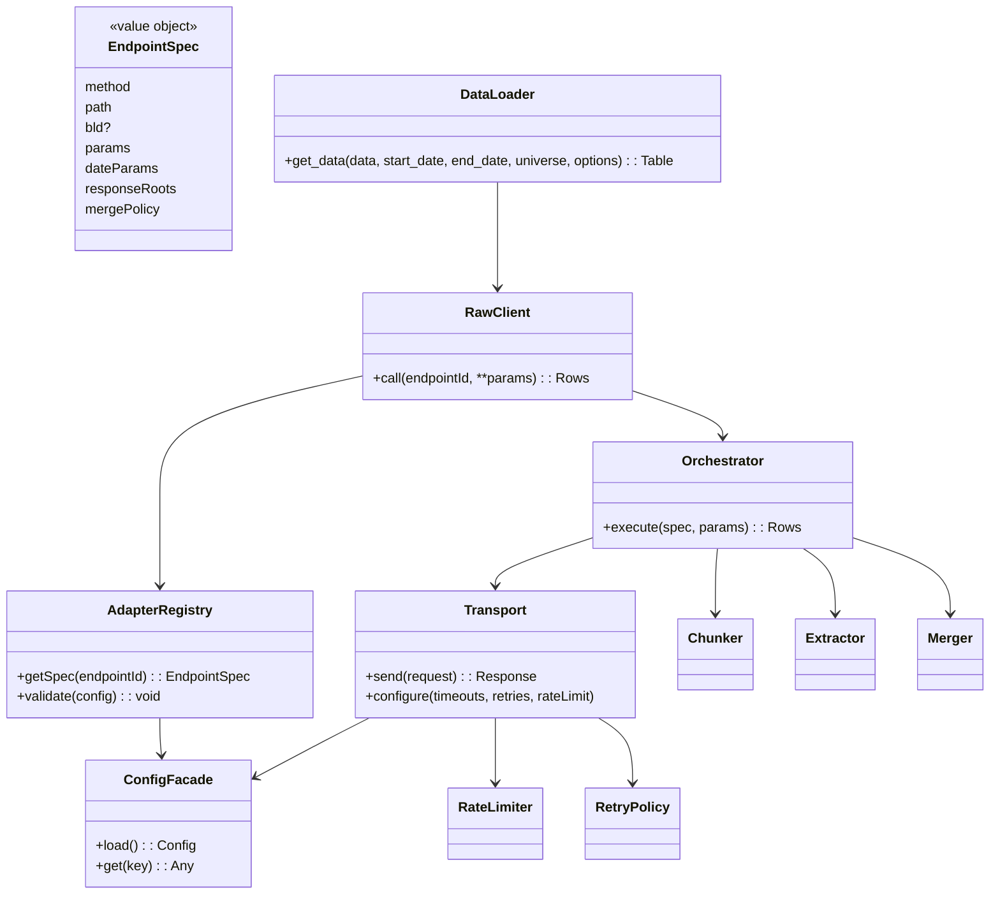
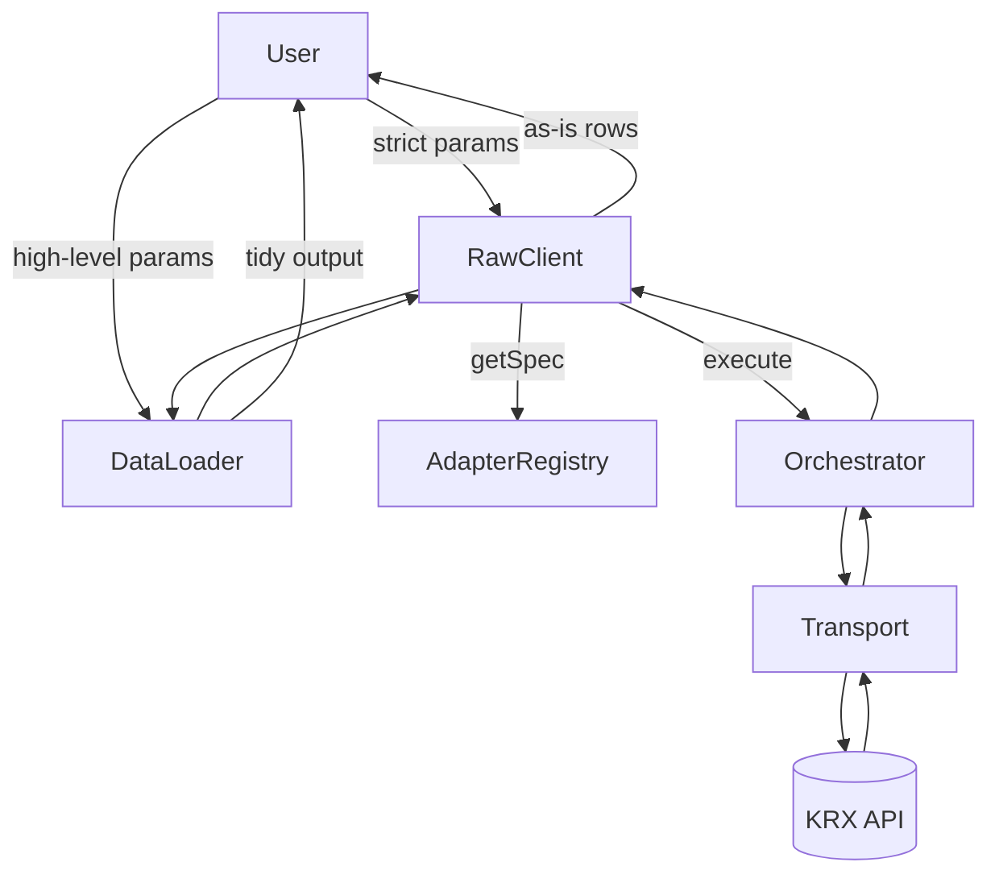
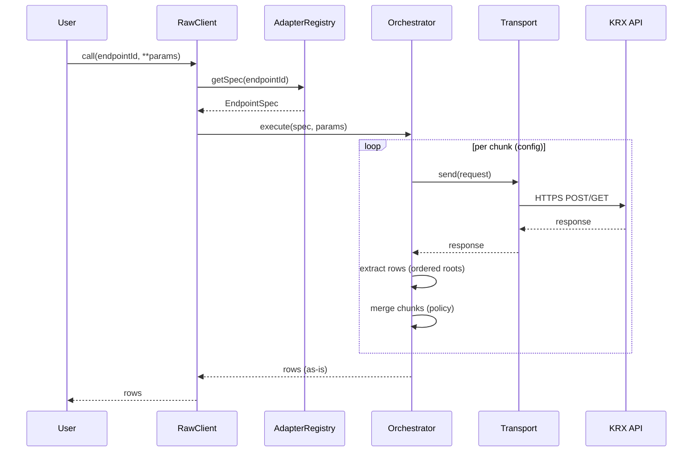
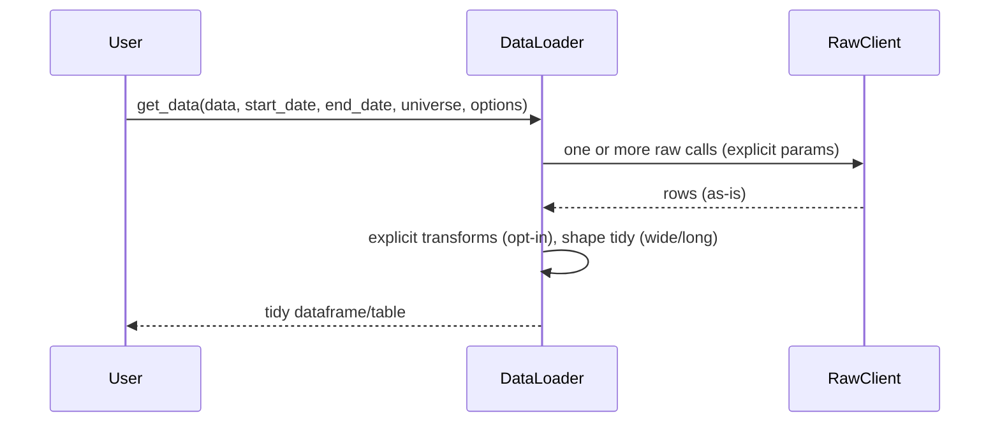
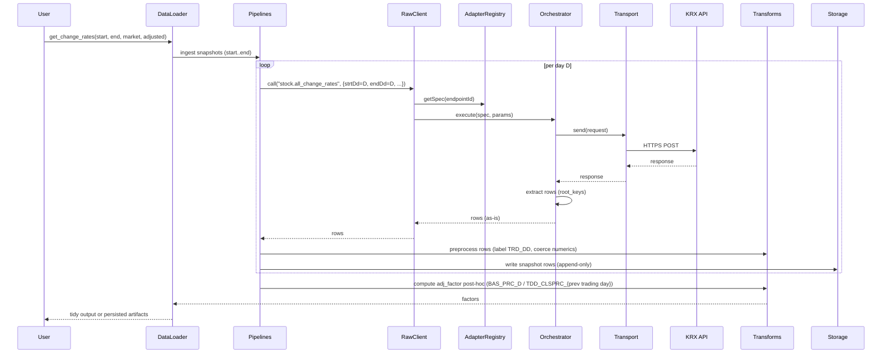
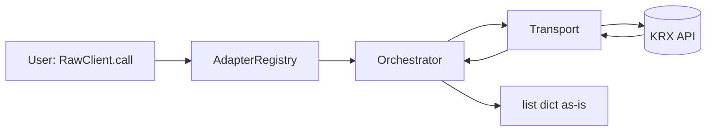
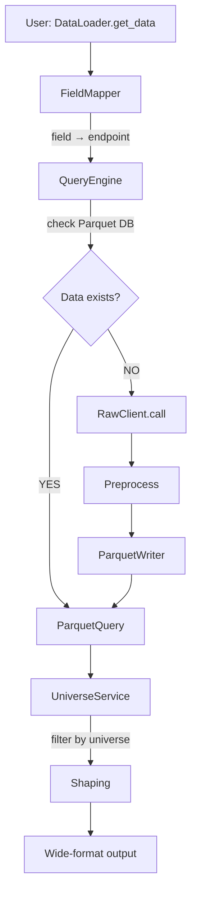
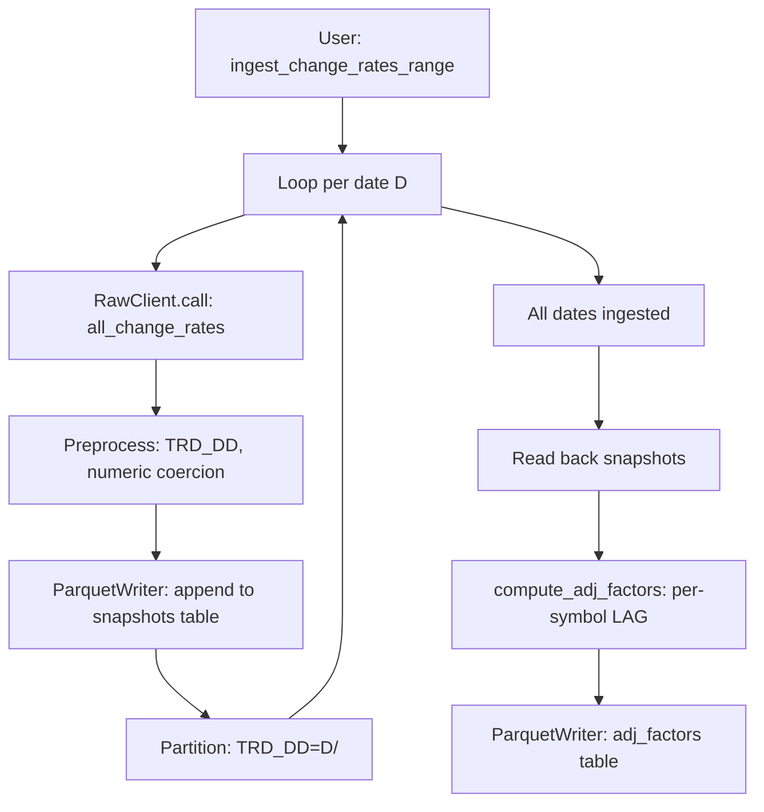
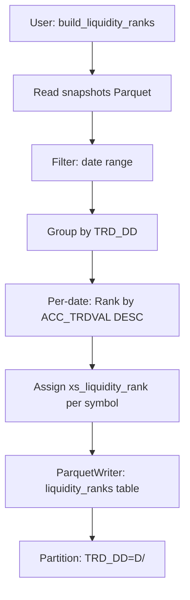
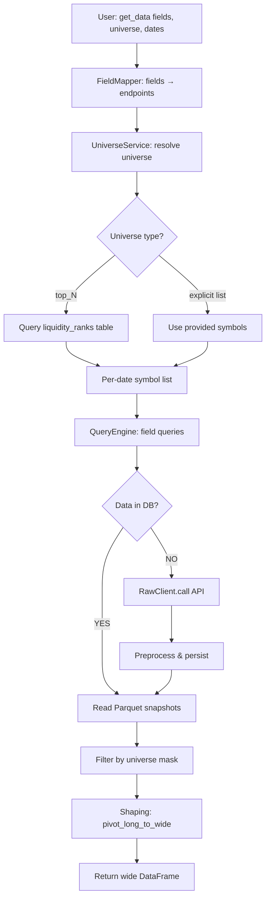

# Architecture: KRX Quant Data Loader (KQDL)

This document specifies the high-level architecture that implements the PRD. It focuses on module boundaries, responsibilities, directory scaffold, and the flow of data. It intentionally avoids code-level details or concrete configuration examples; those belong in implementation.md and config specs.

## Scope and principles

- **As-is data:** Raw layer returns server data without silent transforms or source substitution.
- **Config-driven:** Endpoint specs AND field mappings live in YAML; code is generic and reusable.
- **Three-layer architecture:**
  - **Layer 1 (Raw):** Direct 1:1 KRX API wrapper (endpoint-based, `list[dict]` output)
  - **Layer 2 (Services):** DB-backed data services (field mapper, universe resolver, query engine)
  - **Layer 3 (DataLoader):** Quant-friendly field-based API (wide-format output, universe filtering)
- **DB-first with API fallback:** Query local Parquet DB for pre-ingested data; fetch from KRX API if missing.
- **Market-wide DB build:** Leverage market-wide endpoints (e.g., `all_change_rates`) to build comprehensive DB; filter client-side for subsets.
- **Hive-partitioned Parquet storage:** Partition by `TRD_DD` (trade date) for fast filtering and incremental ingestion.
- **Batch post-processing:** Adjustment factors and liquidity ranks computed AFTER snapshot ingestion (not during).
- **Transport hygiene & observability:** HTTPS, timeouts, retries, rate limits, structured logs, metrics.

## Architectural patterns

### 1. Three-layer separation of concerns
- **Layer 1 (Raw):** Thin, strict wrapper over KRX API. Zero business logic, just endpoint routing and as-is data return.
- **Layer 2 (Services):** Where intelligence lives—field mapping, universe resolution, DB-first queries with API fallback.
- **Layer 3 (DataLoader):** User-facing ergonomic API. Composes Layer 2 services, returns analyst-ready wide-format data.

**Rationale:** Clear separation enables independent testing and evolution. Raw layer is stable (1:1 KRX mapping). Services layer encapsulates quant domain logic. DataLoader layer adapts to user workflows.

### 2. DB-first with incremental ingestion
- **Query flow:** Always check Parquet DB first. If data missing, fetch from KRX API, preprocess, persist, then return.
- **Incremental build:** Users can build DB gradually over time. Missing date ranges auto-fetched on first query.
- **No full backfill required:** Start with recent data; historical data fetched on-demand as users query it.

**Rationale:** Reduces initial setup burden. Optimizes for most common use case (recent data). Scales well as DB grows.

### 3. Market-wide endpoints + client-side filtering
- **Ingestion:** Always fetch ALL stocks for a given date (e.g., `all_change_rates` returns ~3000 stocks/day).
- **Storage:** Store complete market snapshots in Parquet (partitioned by date).
- **Filtering:** Apply universe masks (top_100, custom list) AFTER retrieval from DB.

**Rationale:** 
- Market-wide endpoints are more efficient than per-symbol calls (fewer API requests, bulk data transfer).
- Complete snapshots enable ad-hoc universe definitions without re-fetching.
- Pre-computed liquidity ranks require complete cross-section per date anyway.

### 4. Hive partitioning for fast queries
- **Partition key:** `TRD_DD` (trade date, format YYYYMMDD).
- **Directory structure:** `snapshots/TRD_DD=20230101/data.parquet`, `snapshots/TRD_DD=20230102/data.parquet`, etc.
- **Query optimization:** Date-range filters leverage partition pruning (read only relevant partitions).

**Rationale:** 
- Time-series financial data naturally partitioned by date.
- Most queries are date-range bound (e.g., last 6 months, YTD).
- Partition pruning reduces I/O by orders of magnitude for large DBs.

### 5. Batch post-processing (not streaming)
- **Adjustment factors:** Computed AFTER all snapshots ingested (requires complete table for per-symbol LAG).
- **Liquidity ranks:** Computed AFTER snapshots (requires complete cross-section per date).
- **Decoupled pipelines:** Ingestion → Snapshots → Adj Factors → Liquidity Ranks (each can run independently).

**Rationale:**
- Simplifies ingestion logic (no complex streaming state management).
- Enables idempotent reruns (e.g., recompute ranks for updated snapshots).
- SQL-like semantics (GROUP BY, LAG) naturally expressed in batch operations.

## Package scaffold (high-level)

```text
krx_quant_dataloader/
  __init__.py                # Factory: ConfigFacade → Transport → AdapterRegistry → Orchestrator → RawClient → DataLoader
  
  # Layer 1: Raw KRX API Wrapper
  config/                    # Pydantic settings, endpoint registry, field mappings (YAML)
  transport/                 # HTTPS session, retries, timeouts, rate limits
  adapter/                   # Endpoint registry, validation, spec normalization
  orchestration/             # Request builder, chunker, extractor, merger
  client/                    # Raw interface (as‑is), param validation/defaults
  
  # Layer 2: DB-Backed Data Services
  apis/
    field_mapper.py          # Maps field names → endpoints (loads field_mappings.yaml)
    universe_service.py      # Resolves universe specs → symbols per date (queries Parquet DB)
    query_engine.py          # DB-first query with API fallback
  
  # Layer 3: High-Level DataLoader API
  apis/
    dataloader.py            # Field-based queries, wide-format output, universe filtering
  
  # Core Transforms & Pipelines
  transforms/
    preprocessing.py         # TRD_DD labeling, numeric coercion (comma strings → int)
    shaping.py               # Wide/long pivot operations (pivot_long_to_wide)
    adjustment.py            # Per-symbol LAG-style factor computation
    validation.py            # Optional schema validation
  
  pipelines/
    snapshots.py             # Resume-safe per-day ingestion to Parquet DB
    universe_builder.py      # Batch liquidity rank computation (post-ingestion)
    loaders.py               # Optional: batch loaders for other endpoints
  
  # Storage Layer (Parquet-based)
  storage/
    protocols.py             # SnapshotWriter protocol (ABC)
    writers.py               # ParquetSnapshotWriter (Hive-partitioned), CSVSnapshotWriter (legacy)
    query.py                 # Parquet query helpers (PyArrow/DuckDB integration)
    schema.py                # Parquet schema definitions
  
  domain/                    # Lightweight models and typed errors (no IO)
  
  # Config Files (YAML)
  config/
    endpoints.yaml           # Endpoint specs (existing)
    field_mappings.yaml      # Field → endpoint mappings (NEW)
```

Notes:

- The exact classes, functions, and data structures are intentionally abstracted here.
- Optional dependencies (e.g., pandas/pyarrow) are used primarily by `kqdl.apis`.

## Component responsibilities

### Layer 1: Raw KRX API Wrapper

- **Transport** (`transport/`)
  - HTTPS-only session with timeouts, bounded retries/backoff, per-host rate limiting.
  - Emits structured logs and metrics for requests.
  
- **Adapter** (config registry)
  - Loads and validates endpoint YAML.
  - Exposes immutable endpoint specs (method, path, `bld`, params with roles, client policy, response root keys).
  
- **Orchestration** (`orchestration/`)
  - Builds requests from spec+params, executes chunking loops, extracts rows via ordered root keys, merges chunks per policy.
  - No transforms beyond merge/ordering; never substitutes sources.
  
- **RawClient** (`client.py`)
  - Public, strict surface requiring full endpoint parameters.
  - Returns as-is results (`list[dict]`), with typed errors.

### Layer 2: DB-Backed Data Services

- **FieldMapper** (`apis/field_mapper.py`) *(NEW)*
  - Loads `config/field_mappings.yaml` mapping field names (종가, PER, PBR) → (endpoint_id, response_key).
  - Example: `"종가"` → `("stock.all_change_rates", "TDD_CLSPRC")`
  - Enables field-based queries in DataLoader without hardcoding endpoint logic.

- **UniverseService** (`apis/universe_service.py`) *(NEW)*
  - Resolves universe specifications → per-date symbol lists:
    - Explicit list: `['005930', '000660']` → use as-is
    - Pre-computed: `'top_100'` → query `liquidity_ranks` Parquet table
  - Returns: `{date: [symbols]}` mapping for filtering DataLoader results.

- **QueryEngine** (`apis/query_engine.py`) *(NEW)*
  - **DB-first:** Query local Parquet DB for requested (field, date_range).
  - **API fallback:** If data missing, fetch from KRX via RawClient, preprocess, and persist to DB.
  - **Incremental ingestion:** Users can build DB over time; missing dates trigger automatic fetch.
  - Returns raw data rows; filtering and shaping handled by DataLoader.

### Layer 3: High-Level DataLoader API

- **DataLoader** (`apis/dataloader.py`)
  - Public, ergonomic surface: `get_data(fields, universe, start_date, end_date, options)`
  - Composes FieldMapper, UniverseService, QueryEngine.
  - Applies universe filtering and shaping (wide format via `pivot_long_to_wide`).
  - Returns analyst-ready DataFrame (dates × symbols).

### Core Transforms & Pipelines

- **Transforms** (`transforms/`)
  - **Preprocessing** (`preprocessing.py`): Client‑side labeling (e.g., `TRD_DD`), numeric coercions (comma-separated strings → int).
  - **Shaping** (`shaping.py`): Wide/long pivots for tidy outputs (`pivot_long_to_wide`); no data cleaning.
  - **Adjustment** (`adjustment.py`): Post‑hoc per‑symbol, date‑ordered factors (SQL LAG semantics); pure computation, no I/O.
  - **Validation** (`validation.py`): Optional schema validation.

- **Pipelines** (`pipelines/`)
  - **Snapshots** (`snapshots.py`):
    - Resume‑safe ingestion: `ingest_change_rates_day()` fetches one day, preprocesses, persists via `ParquetWriter`.
    - `ingest_change_rates_range()` iterates dates with per-day isolation (errors on one day do not halt subsequent days).
    - Post-hoc adjustment: `compute_and_persist_adj_factors()` runs AFTER ingestion; computes per-symbol factors.
  - **Universe Builder** (`universe_builder.py`) *(NEW)*:
    - Batch post-processing: Reads snapshots Parquet, ranks by `ACC_TRDVAL` per date.
    - Outputs: `liquidity_ranks` table with `(TRD_DD, ISU_SRT_CD, xs_liquidity_rank, ACC_TRDVAL)`.
    - Idempotent: Can re-run for new date ranges.
  - **Loaders** (`loaders.py`): Optional batch loaders for other endpoints.

### Storage Layer (Parquet-based)

- **Protocols** (`storage/protocols.py`)
  - `SnapshotWriter` protocol for dependency injection; decouples pipelines from storage backend.

- **Writers** (`storage/writers.py`)
  - **`ParquetSnapshotWriter`**: Hive-partitioned by `TRD_DD` (e.g., `snapshots/TRD_DD=20230101/`).
    - Append-only snapshots; overwrites partition if re-ingesting same date (idempotent).
    - Three tables: `snapshots`, `adj_factors`, `liquidity_ranks`.
  - **`CSVSnapshotWriter`**: Legacy/debugging; UTF-8, no BOM, append-only.

- **Query** (`storage/query.py`)
  - Parquet query helpers using **PyArrow** (partition pruning) and **DuckDB** (SQL-like aggregations).
  - Date-range filters: `TRD_DD >= start AND TRD_DD <= end` → partition pruning.
  - Universe filters: `ISU_SRT_CD IN (...)` or `xs_liquidity_rank <= 100`.

- **Schema** (`storage/schema.py`)
  - Parquet schema definitions:
    - **snapshots**: `TRD_DD, ISU_SRT_CD, ISU_ABBRV, MKT_NM, BAS_PRC, TDD_CLSPRC, CMPPREVDD_PRC, ...`
    - **adj_factors**: `TRD_DD, ISU_SRT_CD, adj_factor` (forward-fill semantics for missing days).
    - **liquidity_ranks**: `TRD_DD, ISU_SRT_CD, xs_liquidity_rank, ACC_TRDVAL`.

### Hive Partitioning Strategy

**Partitioning decision: Single-level by `TRD_DD` (trade date)**

```
db/
├── snapshots/
│   ├── TRD_DD=20230101/
│   │   └── data.parquet          # All ~3000 stocks for this date
│   ├── TRD_DD=20230102/
│   │   └── data.parquet
│   └── ...
├── adj_factors/
│   ├── TRD_DD=20230101/
│   │   └── data.parquet          # Sparse (only corporate action days)
│   └── ...
└── liquidity_ranks/
    ├── TRD_DD=20230101/
    │   └── data.parquet          # Small (~100 KB/day)
    └── ...
```

**Rationale:**
- **Query pattern:** Date-range filtering is primary (almost all queries filter by date); universe filtering is secondary (applied after date filtering).
- **Partition pruning:** Date-range queries only scan relevant partitions (e.g., 252 partitions for 1 year vs. 756,000 files with per-symbol partitioning).
- **Avoid small files:** Partitioning by symbol creates 3000 files/day (millions of small files over years); single date partition = 1 file/day (50-200 MB, optimal).
- **Write efficiency:** One file write per date (idempotent overwrite if re-ingesting).

**Why NOT partition by symbol or universe:**
- ❌ **Per-symbol partitioning (`TRD_DD/ISU_SRT_CD`):** Too many small files (3000/day), poor I/O efficiency, metadata overhead.
- ❌ **Per-universe partitioning (`universe/TRD_DD`):** Data duplication (univ500 includes univ100), static universes (membership changes daily).

**Performance optimizations:**

1. **Sorted writes:** Sort data by `ISU_SRT_CD` before writing Parquet; enables row-group pruning.
   ```python
   rows_sorted = sorted(rows, key=lambda r: r['ISU_SRT_CD'])
   # Row group 1: ISU_SRT_CD ['000001' - '010000']
   # Row group 2: ISU_SRT_CD ['010001' - '020000']
   # Query for '005930' → only reads row group 1
   ```

2. **Row group size:** 1000 rows per row group (~1000 stocks); balances row-group pruning granularity vs. overhead.

3. **Compression:** Zstd level 3 (better compression than Snappy, fast decompression).

4. **Column ordering:** Primary filter keys (`ISU_SRT_CD`) early in schema for better row-group statistics.

**Expected query performance (SSD):**
- 100 stocks × 252 days: ~100-500 ms
- 500 stocks × 252 days: ~200-800 ms
- Full market (3000 stocks × 252 days): ~1-3 seconds

**Query execution plan:**
```python
# Step 1: Partition pruning (metadata only, fast)
partitions = [TRD_DD=20230101, ..., TRD_DD=20231231]  # Only 252 partitions scanned

# Step 2: Resolve universe (parallel query on liquidity_ranks)
universe_symbols = {'20230101': ['005930', ...], '20230102': [...], ...}

# Step 3: Read snapshots with optimizations
df = read_parquet(
    partitions=partitions,                      # Partition pruning
    columns=['TRD_DD', 'ISU_SRT_CD', 'TDD_CLSPRC'],  # Column pruning
    filters=[('ISU_SRT_CD', 'in', symbols)]     # Row-group pruning
)

# Step 4: Apply per-date universe mask (in-memory)
df = filter_by_universe(df, universe_symbols)
```

### Supporting Modules

- **Domain** (`domain/`)
  - Lightweight models and typed errors (ConfigError, RegistryValidationError, ParamValidationError). No IO.

- **Observability**
  - Pluggable logging/metrics with consistent context (endpoint id, retries, latency).

- **Config Facade** (`config/`)
  - Centralized configuration (Pydantic settings) for endpoints, field mappings, transport policy.
  - Single YAML load; modules accept config object rather than reading files/env directly.

## Why an Orchestrator

- Problem shape:
  - KRX endpoints vary in date parameter names, maximum fetch spans, and response root keys. To preserve “as‑is” semantics you must: build payloads from specs, loop date chunks per policy, call transport, extract rows using ordered root keys, then merge chunks without transforming values.

- With an orchestrator:
  - Single place to implement chunking/extraction/merge policy; avoids duplication and drift across endpoints.
  - Clear separation: adapter (specs only), transport (IO only), raw client (thin facade), apis (tidy outputs). Each layer has one responsibility.
  - Enforces the “as‑is” contract on the raw path (no transforms/fallbacks), with uniform logging/metrics.
  - Testability: unit-test loops/merges/extraction once with mocks; robust and cheaper to maintain.

- Without an orchestrator:
  - The loop and extraction logic leaks into RawClient and/or individual call sites, increasing duplication and inconsistency.
  - Transport or adapter risk absorbing non‑concerns (e.g., chunking in transport, execution logic in adapter), blurring boundaries.
  - Higher test surface area and greater risk of inadvertently introducing transforms in the raw path.

- Conclusion:
  - Centralizing the mechanical workflow (chunk → request → extract → merge) in an orchestrator reduces complexity elsewhere, keeps the raw client thin, and preserves the PRD’s “as‑is” guarantees. For very small scopes, you could inline this logic, but as endpoints grow, the orchestrator pays for itself quickly.

## UML: high-level classes/components



## User flow (two public interfaces)



## Sequence: raw call (as-is)



## Sequence: apis call (tidy)



## Sequence: MDCSTAT01602 daily snapshot with adj_factor



## Data flow: Three-layer architecture

### Layer 1: Raw API (endpoint-based, as-is)


### Layer 2: DB Services (field-based, DB-first)


### Layer 3: High-Level DataLoader (wide-format, universe-filtered)


## Pipeline data flows

### Pipeline 1: Market-wide snapshot ingestion (snapshots.py)


**Key decisions:**
- **Market-wide fetch:** Always fetch ALL stocks for date D (not per-symbol).
- **Hive partitioning:** Partition by `TRD_DD` (e.g., `TRD_DD=20230101/`) for fast date-range queries.
- **Resume-safe:** If ingestion fails on day D, restart from D; already-ingested partitions are idempotent (overwrite or UPSERT).
- **Post-hoc factors:** Adjustment factors computed AFTER all snapshots ingested; requires complete table for LAG operation.

### Pipeline 2: Liquidity universe builder (universe_builder.py)


**Key decisions:**
- **Batch post-processing:** Run AFTER snapshot ingestion (not during).
- **Cross-sectional:** Ranking is per-date (survivorship bias-free).
- **Rank storage:** Store `TRD_DD, ISU_SRT_CD, xs_liquidity_rank, ACC_TRDVAL` for fast universe queries.
- **Incremental:** Can re-run for new date ranges without re-ranking old dates.

### Pipeline 3: DataLoader query flow (dataloader.py)


**Key decisions:**
- **DB-first:** Always check Parquet DB before calling API.
- **Incremental build:** Missing dates auto-fetched and persisted.
- **Universe filtering:** Applied AFTER data retrieval (filter client-side, not in query).
- **Wide format:** Default output is dates × symbols for quant analysis.

## Configuration

- Config facade (Pydantic settings): one-time load/validation; modules accept a config object rather than reading files/env themselves.
- Bootstrapping without DI: initialize shared objects explicitly in a small composition root (e.g., package-level factory) and pass them down:
  1) Create ConfigFacade.
  2) Create Transport with config.
  3) Create AdapterRegistry from config.endpoints (single YAML load; no file IO here).
  4) Create Orchestrator(Transport).
  5) Create RawClient(AdapterRegistry, Orchestrator).
  6) Create DataLoader(RawClient).

### Configuration evolution: YAML vs typed models

- YAML is the source of data; typed models enforce policy. We intentionally couple only the stable, safety‑critical subset to code:
  - Strict (validated early): per‑host settings and transport policy (`HostConfig`, `TransportConfig`, `RetriesConfig`, `RateLimitConfig`). These enforce invariants such as HTTPS‑only, positive timeouts, and allowed HTTP versions. Breaking changes here should fail early and may require code updates.
  - Flexible (schema‑agile): endpoint registry (`endpoints`) remains a plain mapping. Its detailed validation and evolution happen in the Adapter layer, so additive changes to endpoint specs do not require changes in this config module.
- Forward compatibility: additive YAML keys are tolerated by default (unknown fields are ignored unless we explicitly forbid them). This allows config to evolve without code churn. `AdapterRegistry` normalizes endpoint entries (e.g., infers date_params from param roles and reads client_policy.chunking) so tests and code remain stable under schema tweaks.
- Versioning: a top‑level `version` field enables controlled migrations when we intentionally change strict shapes or policies. Migration logic can adapt old YAML to current in‑memory models.
- Rationale: this balance preserves early, typed guardrails where correctness and security matter (transport/hosts) while keeping the volatile parts (endpoints) config‑driven and decoupled.

## Subpackage boundaries

- apis depends on client (raw) only; it must not import transport/orchestration/adapter directly.
- client depends on orchestration and adapter; it must not import apis.
- orchestration depends on transport; it must not import apis or client.
- adapter is pure config/metadata; no network IO.
- transport is pure IO; does not import business modules.
- observability is a cross-cutting utility; other modules call into it, not vice versa.

## Error taxonomy (high-level)

- Validation/ConfigError: invalid/missing params or malformed registry.
- TransportError: connection, timeouts, HTTP non-2xx; includes status/latency metadata.
- ExtractionError: expected roots missing; shows available keys and endpoint id.
- TransformError (apis): invalid or impossible transformation request.

## Extensibility and deployment notes

- New endpoints: add to YAML and validate; raw client and apis consume via adapter without code changes.
- Optional extras: apis-related dependencies (e.g., pandas) can be optional to keep the raw client lightweight.
- Observability: logs and metrics can be integrated with user's stack (e.g., stdlib logging, OpenTelemetry, Prometheus).

---

## Testing philosophy

**Live smoke tests as primary validation:**
- Real KRX API calls validate actual data schemas, preprocessing, shaping, and pipeline behavior.
- Print sample outputs to terminal for visual inspection and debugging.
- Ensures pipeline works with real KRX responses, including holiday handling and schema variations.

**Unit tests as secondary:**
- Cover edge cases, pure logic, and error conditions after live tests confirm real-world behavior.
- Use fakes/stubs for fast, deterministic validation.

**Integration tests:**
- Validate storage writers (CSV, SQLite) with real I/O using temporary files.
- Confirm UPSERT behavior, encoding (UTF-8, no BOM), and append-only semantics.

**Test structure:**
```
tests/
  test_transforms_preprocessing_live_smoke.py
  test_transforms_adjustment_live_smoke.py
  test_transforms_shaping_live_smoke.py
  test_storage_writers_live_smoke.py
  test_pipelines_snapshots_live_smoke.py
  unit/
    test_transforms_*.py           # Edge cases, pure logic
    test_storage_writers_unit.py   # Fake dependencies
  integration/
    test_storage_writers_csv.py    # Real CSV I/O
    test_storage_writers_sqlite.py # Real SQLite I/O
```

**Rationale:**
- Live tests catch schema drift and real-world issues immediately.
- Visual output aids debugging and provides documentation of actual data formats.
- Resume-safe pipeline validated with actual holidays and multi-day sequences.

---

This document is intentionally high-level. Concrete interfaces, schemas, and parameter names will be defined in implementation.md and in the configuration specifications.
