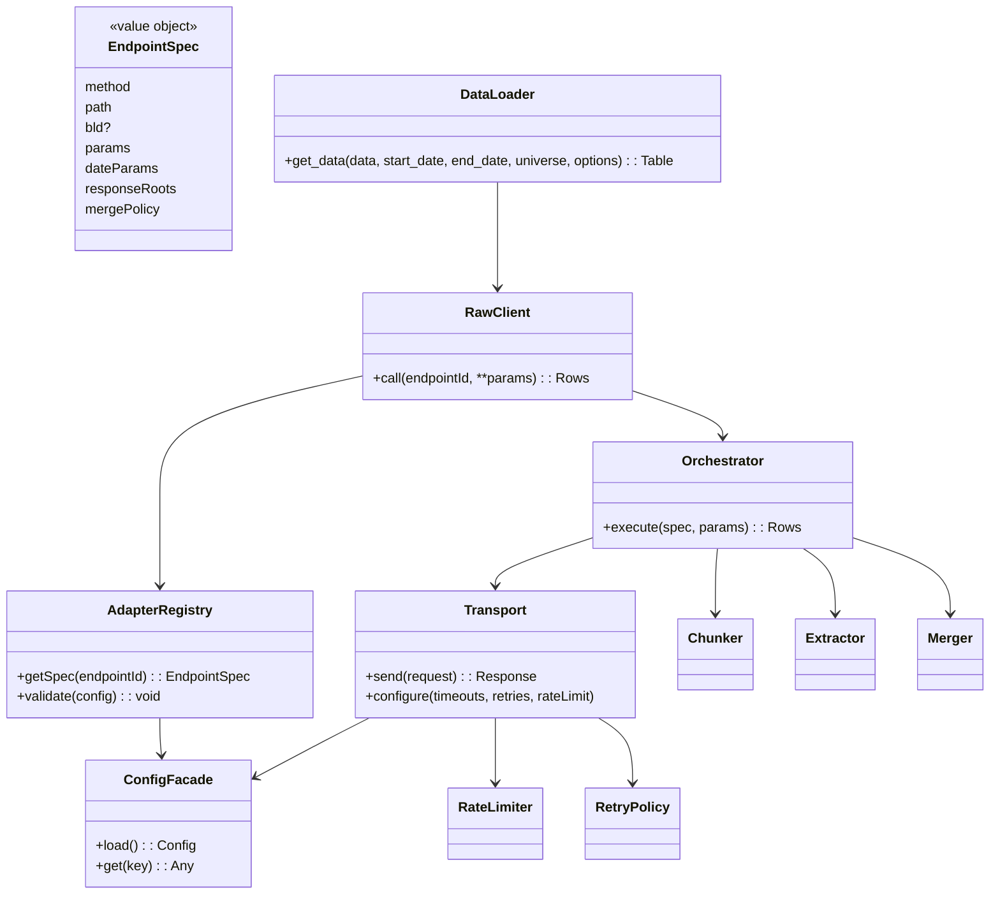
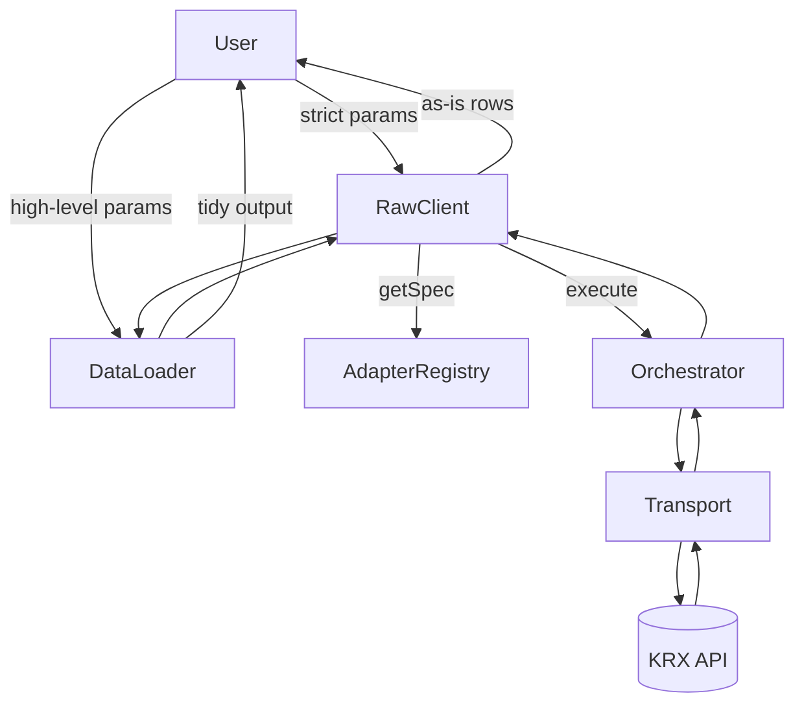
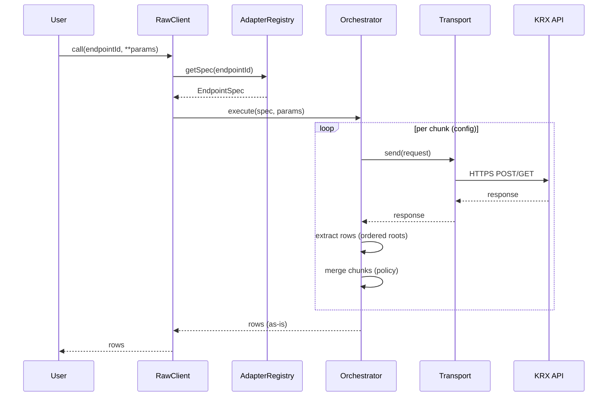
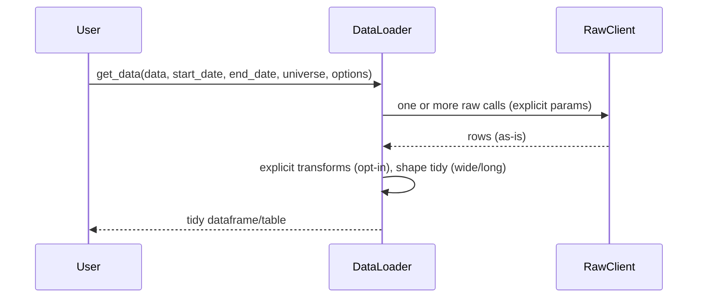
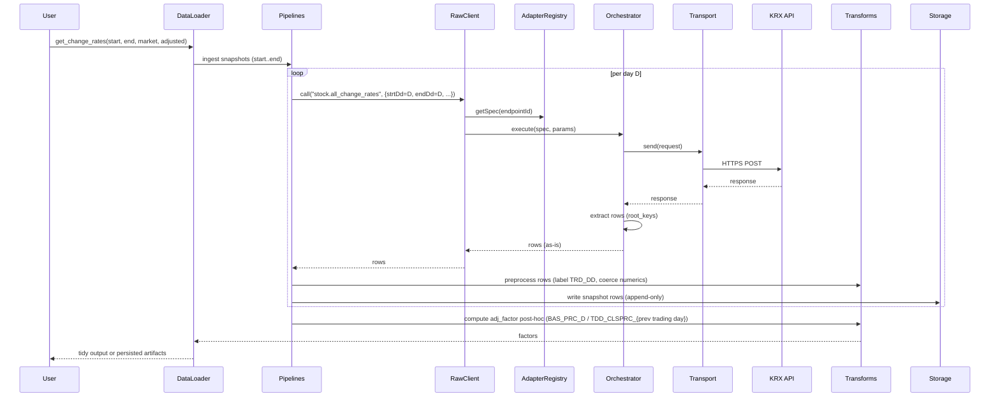
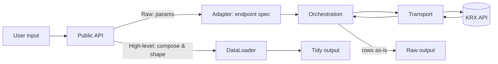

# Architecture: KRX Quant Data Loader (KQDL)

This document specifies the high-level architecture that implements the PRD. It focuses on module boundaries, responsibilities, directory scaffold, and the flow of data. It intentionally avoids code-level details or concrete configuration examples; those belong in implementation.md and config specs.

## Scope and principles

- As-is data: Raw layer returns server data without silent transforms or source substitution.
- Config-driven endpoints: Endpoint specs live in YAML; code consumes them (no hard-coded specs).
- Two public interfaces:
  - Raw interface (kqdl.client): strict, requires full endpoint params, returns as-is results.
  - High-level interface (kqdl.apis): DataLoader-style API that composes endpoints and returns tidy outputs; any transforms are explicit.
- Transport hygiene & observability: HTTPS, timeouts, retries, rate limits, structured logs, metrics.

## Package scaffold (high-level)

```text
krx_quant_dataloader/
  __init__.py                # Factory: ConfigFacade → Transport → AdapterRegistry → Orchestrator → RawClient → DataLoader
  config/                    # Pydantic settings facade (single YAML load)
  transport/                 # HTTPS session, retries, timeouts, rate limits
  adapter/                   # Endpoint registry, validation, spec normalization
  orchestration/             # Request builder, chunker, extractor, merger
  client/                    # Raw interface (as‑is), param validation/defaults
  apis/                      # User‑facing DataLoader APIs (tidy is opt‑in)
  domain/                    # Lightweight models and typed errors (no IO)
  transforms/
    preprocessing.py         # TRD_DD labeling, numeric coercion (comma strings → int)
    shaping.py               # Wide/long pivot operations
    adjustment.py            # Per-symbol LAG-style factor computation
    validation.py            # Optional schema validation
  pipelines/
    snapshots.py             # Resume-safe per-day ingestion + post-hoc adj_factor
    loaders.py               # Optional: batch loaders for other endpoints
  storage/
    protocols.py             # SnapshotWriter protocol (ABC)
    writers.py               # CSVSnapshotWriter, SQLiteSnapshotWriter
    schema.py                # Minimal DDL suggestions
```

Notes:

- The exact classes, functions, and data structures are intentionally abstracted here.
- Optional dependencies (e.g., pandas/pyarrow) are used primarily by `kqdl.apis`.

## Component responsibilities

- Transport
  - HTTPS-only session with timeouts, bounded retries/backoff, per-host rate limiting.
  - Emits structured logs and metrics for requests.
- Adapter (config registry)
  - Loads and validates endpoint YAML.
  - Exposes immutable endpoint specs (method, path, `bld` if applicable, params with roles, client policy (e.g., chunking), response root keys and fields, merge/order) via a facade object.
- Orchestration
  - Builds requests from spec+params, executes chunking loops, extracts rows via ordered root keys, merges chunks per policy.
  - No transforms beyond merge/ordering; never substitutes sources.
- Client (raw)
  - Public, strict surface requiring full endpoint parameters.
  - Returns as-is results (merged if chunked), with typed errors.
- APIs (DataLoader)
  - Public, ergonomic surface over the raw client.
  - Performs explicit, opt-in transforms, returns tidy outputs suitable for analytics.
- Domain (new)
  - Centralizes lightweight row aliases and typed errors (ConfigError, RegistryValidationError, ParamValidationError). No IO.
- Transforms (expanded)
  - Preprocessing (`transforms/preprocessing.py`): client‑side labeling (e.g., `TRD_DD`), numeric coercions (comma-separated strings → int); no pivoting.
  - Shaping (`transforms/shaping.py`): wide/long pivots for tidy outputs; no data cleaning or type coercion.
  - Adjustment (`transforms/adjustment.py`): post‑hoc per‑symbol, date‑ordered factors from snapshots (SQL LAG semantics); pure computation, no I/O.
- Pipelines (`pipelines/snapshots.py`)
  - Resume‑safe ingestion: `ingest_change_rates_day()` fetches one day, preprocesses, and persists via a writer before proceeding. `ingest_change_rates_range()` iterates dates with per-day isolation (errors on one day do not halt subsequent days).
  - Post-hoc adjustment: `compute_and_persist_adj_factors()` runs after ingestion over stored snapshots; computes per-symbol factors and persists via writer.
- Storage
  - Protocols (`storage/protocols.py`): `SnapshotWriter` protocol for dependency injection; decouples pipelines from storage backend.
  - Writers (`storage/writers.py`): `CSVSnapshotWriter` (UTF-8, no BOM, append-only) and `SQLiteSnapshotWriter` (UPSERT on composite key).
  - Schema (`storage/schema.py`): Minimal DDL suggestions; actual schemas enforced by writers.
- Observability
  - Pluggable logging/metrics with consistent context (endpoint id, retries, latency).
- Config facade
  - Centralized configuration object (e.g., Pydantic settings) that aggregates environment/app settings and provides a single source of truth to other modules (transport, adapter, orchestration), avoiding repeated loads/validations.

## Why an Orchestrator

- Problem shape:
  - KRX endpoints vary in date parameter names, maximum fetch spans, and response root keys. To preserve “as‑is” semantics you must: build payloads from specs, loop date chunks per policy, call transport, extract rows using ordered root keys, then merge chunks without transforming values.

- With an orchestrator:
  - Single place to implement chunking/extraction/merge policy; avoids duplication and drift across endpoints.
  - Clear separation: adapter (specs only), transport (IO only), raw client (thin facade), apis (tidy outputs). Each layer has one responsibility.
  - Enforces the “as‑is” contract on the raw path (no transforms/fallbacks), with uniform logging/metrics.
  - Testability: unit-test loops/merges/extraction once with mocks; robust and cheaper to maintain.

- Without an orchestrator:
  - The loop and extraction logic leaks into RawClient and/or individual call sites, increasing duplication and inconsistency.
  - Transport or adapter risk absorbing non‑concerns (e.g., chunking in transport, execution logic in adapter), blurring boundaries.
  - Higher test surface area and greater risk of inadvertently introducing transforms in the raw path.

- Conclusion:
  - Centralizing the mechanical workflow (chunk → request → extract → merge) in an orchestrator reduces complexity elsewhere, keeps the raw client thin, and preserves the PRD’s “as‑is” guarantees. For very small scopes, you could inline this logic, but as endpoints grow, the orchestrator pays for itself quickly.

## UML: high-level classes/components



## User flow (two public interfaces)



## Sequence: raw call (as-is)



## Sequence: apis call (tidy)



## Sequence: MDCSTAT01602 daily snapshot with adj_factor



## Data flow (end-to-end)



## Configuration

- Config facade (Pydantic settings): one-time load/validation; modules accept a config object rather than reading files/env themselves.
- Bootstrapping without DI: initialize shared objects explicitly in a small composition root (e.g., package-level factory) and pass them down:
  1) Create ConfigFacade.
  2) Create Transport with config.
  3) Create AdapterRegistry from config.endpoints (single YAML load; no file IO here).
  4) Create Orchestrator(Transport).
  5) Create RawClient(AdapterRegistry, Orchestrator).
  6) Create DataLoader(RawClient).

### Configuration evolution: YAML vs typed models

- YAML is the source of data; typed models enforce policy. We intentionally couple only the stable, safety‑critical subset to code:
  - Strict (validated early): per‑host settings and transport policy (`HostConfig`, `TransportConfig`, `RetriesConfig`, `RateLimitConfig`). These enforce invariants such as HTTPS‑only, positive timeouts, and allowed HTTP versions. Breaking changes here should fail early and may require code updates.
  - Flexible (schema‑agile): endpoint registry (`endpoints`) remains a plain mapping. Its detailed validation and evolution happen in the Adapter layer, so additive changes to endpoint specs do not require changes in this config module.
- Forward compatibility: additive YAML keys are tolerated by default (unknown fields are ignored unless we explicitly forbid them). This allows config to evolve without code churn. `AdapterRegistry` normalizes endpoint entries (e.g., infers date_params from param roles and reads client_policy.chunking) so tests and code remain stable under schema tweaks.
- Versioning: a top‑level `version` field enables controlled migrations when we intentionally change strict shapes or policies. Migration logic can adapt old YAML to current in‑memory models.
- Rationale: this balance preserves early, typed guardrails where correctness and security matter (transport/hosts) while keeping the volatile parts (endpoints) config‑driven and decoupled.

## Subpackage boundaries

- apis depends on client (raw) only; it must not import transport/orchestration/adapter directly.
- client depends on orchestration and adapter; it must not import apis.
- orchestration depends on transport; it must not import apis or client.
- adapter is pure config/metadata; no network IO.
- transport is pure IO; does not import business modules.
- observability is a cross-cutting utility; other modules call into it, not vice versa.

## Error taxonomy (high-level)

- Validation/ConfigError: invalid/missing params or malformed registry.
- TransportError: connection, timeouts, HTTP non-2xx; includes status/latency metadata.
- ExtractionError: expected roots missing; shows available keys and endpoint id.
- TransformError (apis): invalid or impossible transformation request.

## Extensibility and deployment notes

- New endpoints: add to YAML and validate; raw client and apis consume via adapter without code changes.
- Optional extras: apis-related dependencies (e.g., pandas) can be optional to keep the raw client lightweight.
- Observability: logs and metrics can be integrated with user's stack (e.g., stdlib logging, OpenTelemetry, Prometheus).

---

## Testing philosophy

**Live smoke tests as primary validation:**
- Real KRX API calls validate actual data schemas, preprocessing, shaping, and pipeline behavior.
- Print sample outputs to terminal for visual inspection and debugging.
- Ensures pipeline works with real KRX responses, including holiday handling and schema variations.

**Unit tests as secondary:**
- Cover edge cases, pure logic, and error conditions after live tests confirm real-world behavior.
- Use fakes/stubs for fast, deterministic validation.

**Integration tests:**
- Validate storage writers (CSV, SQLite) with real I/O using temporary files.
- Confirm UPSERT behavior, encoding (UTF-8, no BOM), and append-only semantics.

**Test structure:**
```
tests/
  test_transforms_preprocessing_live_smoke.py
  test_transforms_adjustment_live_smoke.py
  test_transforms_shaping_live_smoke.py
  test_storage_writers_live_smoke.py
  test_pipelines_snapshots_live_smoke.py
  unit/
    test_transforms_*.py           # Edge cases, pure logic
    test_storage_writers_unit.py   # Fake dependencies
  integration/
    test_storage_writers_csv.py    # Real CSV I/O
    test_storage_writers_sqlite.py # Real SQLite I/O
```

**Rationale:**
- Live tests catch schema drift and real-world issues immediately.
- Visual output aids debugging and provides documentation of actual data formats.
- Resume-safe pipeline validated with actual holidays and multi-day sequences.

---

This document is intentionally high-level. Concrete interfaces, schemas, and parameter names will be defined in implementation.md and in the configuration specifications.
