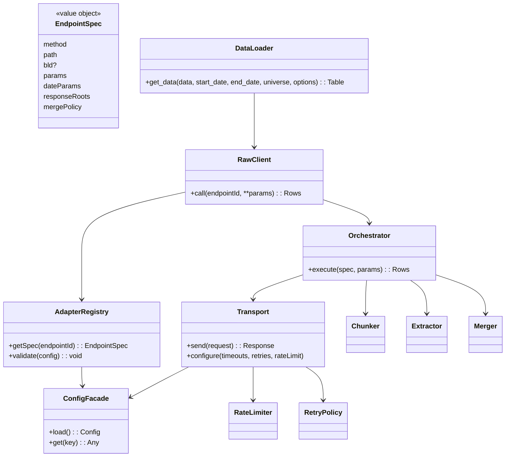
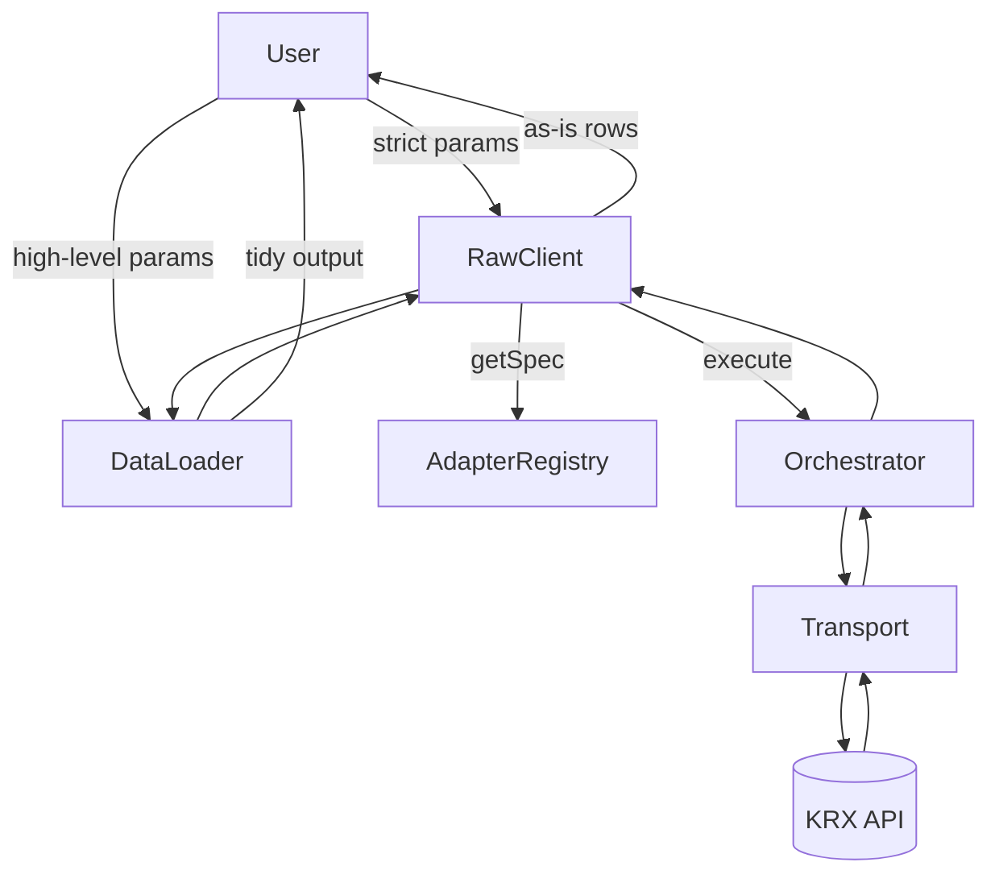
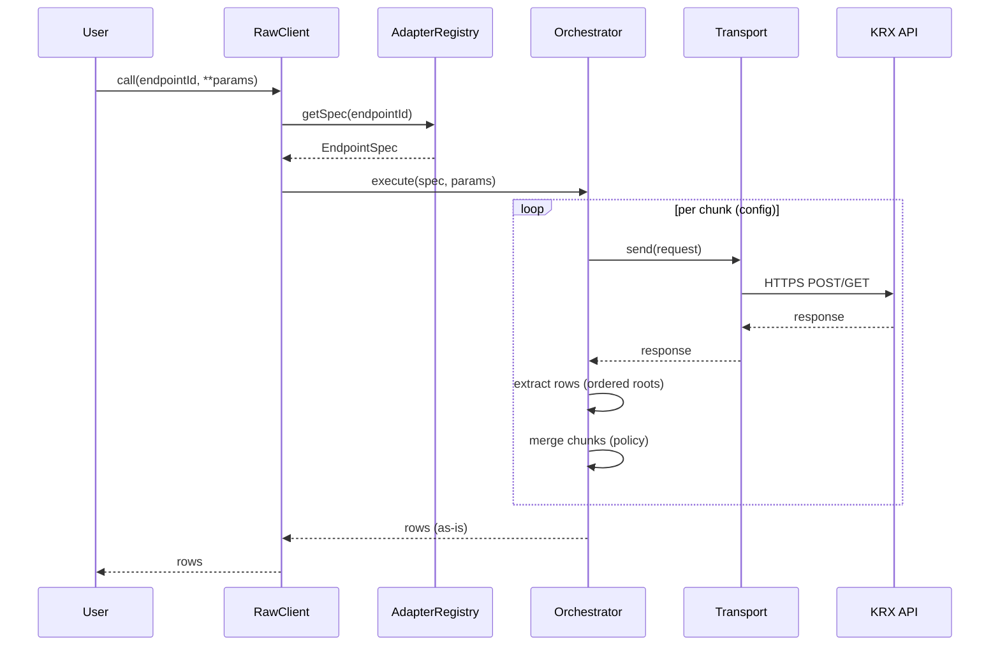
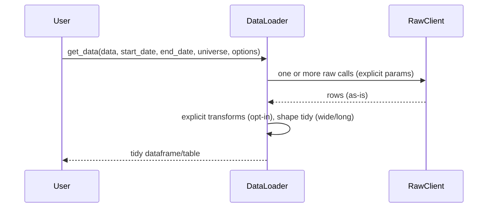
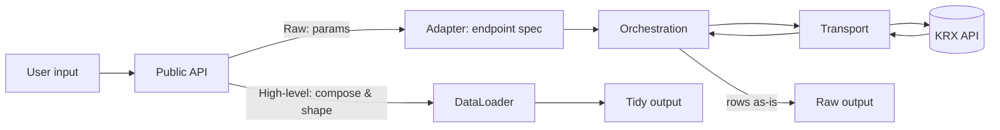

# Architecture: KRX Quant Data Loader (KQDL)

This document specifies the high-level architecture that implements the PRD. It focuses on module boundaries, responsibilities, directory scaffold, and the flow of data. It intentionally avoids code-level details or concrete configuration examples; those belong in implementation.md and config specs.

## Scope and principles

- As-is data: Raw layer returns server data without silent transforms or source substitution.
- Config-driven endpoints: Endpoint specs live in YAML; code consumes them (no hard-coded specs).
- Two public interfaces:
  - Raw interface (kqdl.client): strict, requires full endpoint params, returns as-is results.
  - High-level interface (kqdl.apis): DataLoader-style API that composes endpoints and returns tidy outputs; any transforms are explicit.
- Transport hygiene & observability: HTTPS, timeouts, retries, rate limits, structured logs, metrics.

## Package scaffold (high-level)

```text
kor_quant_dataloader/  (import name: kqdl)
  __init__.py                # Expose DataLoader (apis) and RawClient (client)
  client/                    # Raw interface (as-is)
    __init__.py
  apis/                      # High-level DataLoader APIs (tidy outputs)
    __init__.py
  adapter/                   # Config registry, validation, endpoint specs facade
    __init__.py
  transport/                 # HTTPS session, retries, timeouts, rate limits
    __init__.py
  orchestration/             # Request builder, chunker, extractor, merger
    __init__.py
  transforms/                # Explicit, opt-in transforms (e.g., adjusted prices)
    __init__.py
  observability/             # Logging/metrics hooks (structured logs, counters)
    __init__.py
  config/                    # Default YAMLs and schemas (can be overridden)
    endpoints.yml
    schema.json
tests/
  (contract tests and integration smoke tests)
```

Notes:

- The exact classes, functions, and data structures are intentionally abstracted here.
- Optional dependencies (e.g., pandas/pyarrow) are used primarily by `kqdl.apis`.

## Component responsibilities

- Transport
  - HTTPS-only session with timeouts, bounded retries/backoff, per-host rate limiting.
  - Emits structured logs and metrics for requests.
- Adapter (config registry)
  - Loads and validates endpoint YAML.
  - Exposes immutable endpoint specs (method, path, `bld` if applicable, params, date fields, chunk hints, response root keys, merge policy) via a facade object.
- Orchestration
  - Builds requests from spec+params, executes chunking loops, extracts rows via ordered root keys, merges chunks per policy.
  - No transforms beyond merge/ordering; never substitutes sources.
- Client (raw)
  - Public, strict surface requiring full endpoint parameters.
  - Returns as-is results (merged if chunked), with typed errors.
- APIs (DataLoader)
  - Public, ergonomic surface over the raw client.
  - Performs explicit, opt-in transforms, returns tidy outputs suitable for analytics.
- Transforms (optional)
  - Pure utilities for explicit post-processing (e.g., adjusted close), verbose about formulas and inputs.
- Observability
  - Pluggable logging/metrics with consistent context (endpoint id, retries, latency).
- Config facade
  - Centralized configuration object (e.g., Pydantic settings) that aggregates environment/app settings and provides a single source of truth to other modules (transport, adapter, orchestration), avoiding repeated loads/validations.

## Why an Orchestrator

- Problem shape:
  - KRX endpoints vary in date parameter names, maximum fetch spans, and response root keys. To preserve “as‑is” semantics you must: build payloads from specs, loop date chunks per policy, call transport, extract rows using ordered root keys, then merge chunks without transforming values.

- With an orchestrator:
  - Single place to implement chunking/extraction/merge policy; avoids duplication and drift across endpoints.
  - Clear separation: adapter (specs only), transport (IO only), raw client (thin facade), apis (tidy outputs). Each layer has one responsibility.
  - Enforces the “as‑is” contract on the raw path (no transforms/fallbacks), with uniform logging/metrics.
  - Testability: unit-test loops/merges/extraction once with mocks; robust and cheaper to maintain.

- Without an orchestrator:
  - The loop and extraction logic leaks into RawClient and/or individual call sites, increasing duplication and inconsistency.
  - Transport or adapter risk absorbing non‑concerns (e.g., chunking in transport, execution logic in adapter), blurring boundaries.
  - Higher test surface area and greater risk of inadvertently introducing transforms in the raw path.

- Conclusion:
  - Centralizing the mechanical workflow (chunk → request → extract → merge) in an orchestrator reduces complexity elsewhere, keeps the raw client thin, and preserves the PRD’s “as‑is” guarantees. For very small scopes, you could inline this logic, but as endpoints grow, the orchestrator pays for itself quickly.

## UML: high-level classes/components



## User flow (two public interfaces)



## Sequence: raw call (as-is)



## Sequence: apis call (tidy)



## Data flow (end-to-end)



## Configuration

- Config facade (Pydantic settings): one-time load/validation; modules accept a config object rather than reading files/env themselves.
- Bootstrapping without DI: initialize shared objects explicitly in a small composition root (e.g., package-level factory) and pass them down:
  1) Create ConfigFacade.
  2) Create Transport with config.
  3) Create AdapterRegistry with config.
  4) Create Orchestrator(Transport).
  5) Create RawClient(AdapterRegistry, Orchestrator).
  6) Create DataLoader(RawClient).

## Subpackage boundaries

- apis depends on client (raw) only; it must not import transport/orchestration/adapter directly.
- client depends on orchestration and adapter; it must not import apis.
- orchestration depends on transport; it must not import apis or client.
- adapter is pure config/metadata; no network IO.
- transport is pure IO; does not import business modules.
- observability is a cross-cutting utility; other modules call into it, not vice versa.

## Error taxonomy (high-level)

- Validation/ConfigError: invalid/missing params or malformed registry.
- TransportError: connection, timeouts, HTTP non-2xx; includes status/latency metadata.
- ExtractionError: expected roots missing; shows available keys and endpoint id.
- TransformError (apis): invalid or impossible transformation request.

## Extensibility and deployment notes

- New endpoints: add to YAML and validate; raw client and apis consume via adapter without code changes.
- Optional extras: apis-related dependencies (e.g., pandas) can be optional to keep the raw client lightweight.
- Observability: logs and metrics can be integrated with user’s stack (e.g., stdlib logging, OpenTelemetry, Prometheus).

---

This document is intentionally high-level. Concrete interfaces, schemas, and parameter names will be defined in implementation.md and in the configuration specifications.
